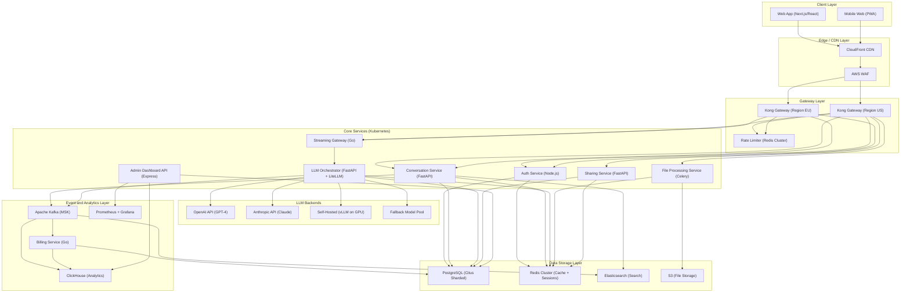
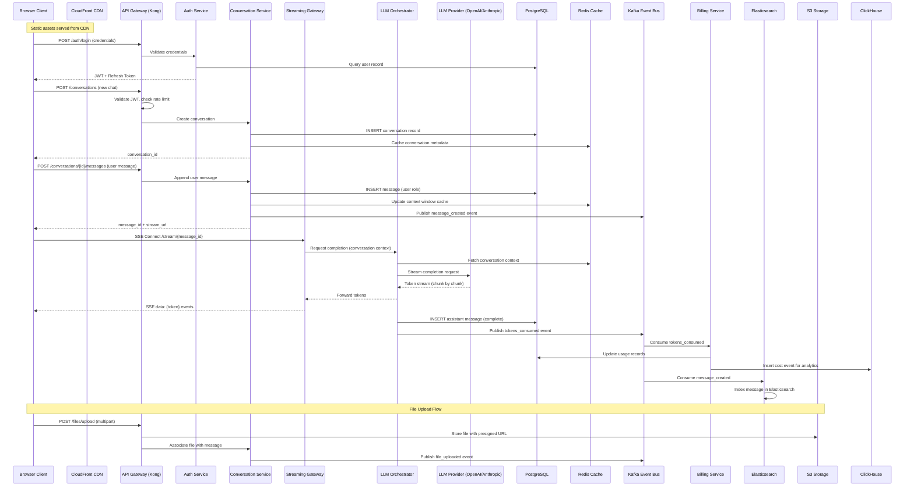

# ChatGPT-like Conversational AI Web Application - High-Level Design

> Generated by **claude-opus-4-6** (anthropic) on 2026-02-08T09:02:04.072Z
> Duration: 355828ms

## Overview

This system is a large-scale conversational AI platform serving 20 million daily active users generating 500 million messages per day. The architecture follows a microservices pattern with clear separation between the real-time streaming layer, conversation management, LLM orchestration, and supporting services. The core design centers on a WebSocket-based streaming gateway that delivers token-by-token responses with sub-500ms time-to-first-token, backed by an LLM orchestration layer that abstracts multiple model backends (OpenAI, Anthropic, self-hosted) with automatic failover. Conversations are persisted in a sharded PostgreSQL cluster for immediate consistency, with Redis caching for hot conversation context, and S3 for file/multimodal uploads.

The system is designed for multi-region deployment with regional WebSocket gateways, global CDN for static assets, and a robust rate-limiting and billing pipeline that tracks per-request token costs. Key architectural decisions include using Server-Sent Events (SSE) over WebSocket for streaming simplicity, CQRS for separating write-heavy message ingestion from read-heavy history/search workloads, and an event-driven architecture via Kafka for decoupling billing, analytics, and audit concerns from the critical path. The admin dashboard is powered by a dedicated analytics pipeline built on ClickHouse for real-time usage monitoring and cost attribution.

## Requirements

### Functional
- User registration, authentication (email, OAuth), and session management with JWT tokens
- Create, continue, and manage multi-turn conversation threads with full context retention
- Real-time streaming of LLM responses token-by-token to the client
- Persistent conversation history with full-text search and folder/tag organization
- Model selection allowing users to choose between different LLM backends per conversation
- File upload support for images, PDFs, and documents with multimodal input to LLMs
- Share conversations via unique public links with optional expiration
- Admin dashboard for monitoring usage metrics, costs, active users, and system health
- Rate limiting and tiered usage quotas (free, plus, enterprise) with enforcement
- Markdown rendering support in responses including code blocks, tables, LaTeX, and syntax highlighting

### Non-Functional
- Time to first token must be under 500ms for streaming responses
- Support at least 100K concurrent WebSocket/SSE connections per region
- Conversation history must be durable with immediate consistency (no eventual consistency for user-facing reads)
- Handle LLM backend failures with automatic failover to alternative providers within 2 seconds
- Per-request cost tracking for accurate billing with less than 0.1% error rate
- 99.95% availability SLA for the overall platform
- Horizontal scalability to handle 500M messages/day (~5,800 messages/sec average, 20K+ peak)
- P99 API response latency under 200ms for non-LLM endpoints (history, search, auth)
- Data encryption at rest and in transit, SOC2 compliance readiness
- Multi-region deployment with data residency compliance for EU/US users
- Graceful degradation under load — queue overflow should return informative wait messages rather than errors

## Architecture Diagram

## Components

### API Gateway

- **Responsibility:** Entry point for all client requests. Handles TLS termination, request routing, authentication verification, rate limiting enforcement, and load balancing across backend services.
- **Technology:** Kong Gateway (on Kubernetes)
- **Justification:** Kong provides built-in rate limiting, JWT validation, request transformation, and plugin ecosystem. It handles both HTTP and WebSocket upgrade requests, supports declarative config via Kubernetes CRDs, and scales horizontally. Preferred over AWS API Gateway for lower latency and more control over WebSocket handling.

### Streaming Gateway

- **Responsibility:** Manages long-lived SSE/WebSocket connections for real-time token streaming from LLM backends to clients. Handles connection lifecycle, heartbeats, backpressure, and reconnection.
- **Technology:** Custom Go service with nhooyr/websocket
- **Justification:** Go excels at handling massive concurrent connections with minimal memory overhead (goroutines use ~4KB vs threads). A custom service allows precise control over backpressure, connection draining, and graceful failover. Each instance can handle 50K+ concurrent connections, needing only 2-3 instances per region for 100K target.

### Auth Service

- **Responsibility:** User registration, login (email/password, Google OAuth, GitHub OAuth), JWT issuance and refresh, session management, and password reset flows.
- **Technology:** Node.js with Passport.js + Redis session store
- **Justification:** Passport.js has mature OAuth provider integrations. Node.js is well-suited for I/O-bound auth workflows. Redis stores refresh tokens and session blacklists for O(1) lookups. JWTs are short-lived (15min) with Redis-backed refresh tokens for revocation capability.

### Conversation Service

- **Responsibility:** Core business logic for creating conversations, appending messages, managing conversation metadata (titles, folders, tags), and serving conversation history with pagination.
- **Technology:** Python (FastAPI)
- **Justification:** FastAPI provides async support, automatic OpenAPI docs, and excellent Python ecosystem integration for ML/AI tooling. Python aligns with the broader AI/ML ecosystem making it easy to integrate tokenizers, prompt engineering libraries, and model-specific utilities.

### LLM Orchestrator

- **Responsibility:** Abstracts multiple LLM backends, handles model routing based on user selection, manages prompt assembly with conversation context, implements retry/failover logic, and streams tokens back to the Streaming Gateway.
- **Technology:** Python (FastAPI) with LiteLLM
- **Justification:** LiteLLM provides a unified interface to 100+ LLM providers (OpenAI, Anthropic, Cohere, self-hosted vLLM). FastAPI's async streaming support enables efficient token forwarding. The orchestrator implements circuit breaker patterns per backend and automatic failover when a provider returns errors or exceeds latency thresholds.

### File Processing Service

- **Responsibility:** Handles file upload, validation, virus scanning, format conversion, image resizing, OCR for documents, and preparing multimodal inputs for LLM consumption.
- **Technology:** Python with Celery workers
- **Justification:** File processing is CPU-intensive and variable in duration — Celery workers can scale independently. Python has excellent libraries for image processing (Pillow), PDF extraction (PyMuPDF), and OCR (Tesseract). Workers pull from a Redis-backed task queue for reliable processing.

### Search Service

- **Responsibility:** Full-text search across conversation history, semantic search for finding relevant past conversations, and powering the organization/filtering UI.
- **Technology:** Elasticsearch 8.x
- **Justification:** Elasticsearch provides fast full-text search with relevance scoring, supports nested document structures ideal for conversations with messages, and offers built-in vector search (kNN) for semantic search. The inverted index is highly optimized for the search-heavy read pattern of conversation history.

### Rate Limiter & Quota Service

- **Responsibility:** Enforces per-user, per-tier rate limits (requests/min, tokens/day), tracks usage quotas, and signals the API gateway to throttle or reject requests.
- **Technology:** Redis Cluster with Lua scripts
- **Justification:** Redis provides sub-millisecond rate limit checks using sliding window counters implemented via Lua scripts for atomicity. Redis Cluster enables horizontal scaling. Token bucket and sliding window algorithms are implemented for different rate limiting needs (burst vs sustained).

### Billing & Cost Tracking Service

- **Responsibility:** Records per-request token usage and costs, aggregates billing data per user/organization, generates invoices, and feeds cost data to the admin dashboard.
- **Technology:** Go service consuming from Kafka
- **Justification:** Go provides the performance needed for high-throughput event processing. Kafka consumption decouples billing from the critical request path — if billing is slow, it doesn't affect user experience. Go's strong typing and low GC pauses ensure accurate, reliable cost aggregation at 500M messages/day.

### Admin Dashboard Backend

- **Responsibility:** Serves aggregated analytics, real-time usage metrics, cost reports, user management, system health monitoring, and model performance dashboards.
- **Technology:** Node.js (Express) + ClickHouse queries
- **Justification:** Node.js is efficient for the I/O-bound dashboard API pattern. ClickHouse provides sub-second analytical queries over billions of rows for real-time dashboards. The admin backend is a lightweight API layer that translates dashboard queries into optimized ClickHouse SQL.

### CDN & Frontend

- **Responsibility:** Serves the React-based SPA, handles static assets, and provides edge caching for shared conversation pages.
- **Technology:** CloudFront CDN + Next.js (React)
- **Justification:** Next.js provides SSR for shared conversation pages (SEO, social previews), static generation for marketing pages, and CSR for the interactive chat UI. CloudFront provides global edge caching with ~20ms latency to users worldwide. React's ecosystem has excellent Markdown rendering libraries (react-markdown, react-syntax-highlighter).

### Event Bus

- **Responsibility:** Decouples services by publishing domain events (message_created, conversation_shared, tokens_consumed) for downstream consumers like billing, analytics, search indexing, and notifications.
- **Technology:** Apache Kafka (MSK)
- **Justification:** Kafka handles the 500M+ events/day throughput with ease, provides exactly-once semantics for billing accuracy, supports multiple consumer groups (billing, analytics, search indexer), and offers configurable retention for replay capability. MSK reduces operational burden.

## Data Flow

## Data Storage

| Store | Type | Justification |
|-------|------|---------------|
| PostgreSQL (Citus) | sql | Primary data store for users, conversations, messages, and billing records. Citus extension enables horizontal sharding by user_id, distributing the 500M messages/day write load across multiple nodes while maintaining strong consistency and ACID transactions within a user's data. Immediate consistency requirement rules out eventually-consistent NoSQL options. Sharding by user_id ensures all conversation data for a user is co-located for efficient joins and queries. |
| Redis Cluster | cache | Multi-purpose caching layer: (1) Conversation context cache — stores the last N messages of active conversations to avoid DB reads on every LLM request, reducing P99 latency. (2) Session/JWT blacklist store for auth. (3) Rate limiting counters with atomic Lua scripts. (4) Celery task broker for file processing. Redis Cluster provides automatic partitioning across 6+ nodes with built-in failover. |
| Elasticsearch 8.x | search | Powers full-text search across conversation history with BM25 relevance scoring and supports vector search (kNN) for semantic similarity. Conversations are indexed asynchronously via Kafka consumers, so search indexing doesn't block the critical write path. Supports nested documents for conversation-message hierarchy and faceted filtering by date, model, folder. |
| Amazon S3 | blob | Stores uploaded files (images, PDFs, documents) and conversation export archives. S3 provides 11 nines of durability, lifecycle policies for cost optimization (move old files to Glacier), and presigned URLs for secure direct client uploads. Multipart upload support handles large files efficiently. |
| Apache Kafka (MSK) | queue | Event streaming backbone carrying domain events (message_created, tokens_consumed, file_uploaded, conversation_shared) to downstream consumers. Kafka's partitioned log model supports parallel consumption by billing, search indexer, and analytics pipelines independently. At 500M messages/day, Kafka's throughput (millions of msgs/sec per cluster) provides massive headroom. Exactly-once semantics ensure billing accuracy. |
| ClickHouse | sql | Columnar OLAP database for real-time analytics powering the admin dashboard. Handles aggregation queries over billions of events (messages, token usage, costs) with sub-second response times. MergeTree engine provides efficient time-series storage with automatic data compaction. Chosen over Redshift for lower latency on interactive queries and over Druid for simpler operations. |

## API Design

| Method | Endpoint | Description |
|--------|----------|-------------|
| POST | `/api/v1/auth/login` | Authenticate user with email/password or OAuth token. Returns short-lived JWT access token (15min) and long-lived refresh token. Sets secure httpOnly cookie for refresh token. |
| POST | `/api/v1/auth/refresh` | Exchange a valid refresh token for a new JWT access token. Implements refresh token rotation — old token is invalidated in Redis upon use. |
| POST | `/api/v1/conversations` | Create a new conversation thread. Accepts optional model selection, system prompt, and folder assignment. Returns conversation_id and initial metadata. |
| GET | `/api/v1/conversations` | List user's conversations with pagination, filtering (by folder, date range, model), and sorting. Returns conversation metadata including title, last message timestamp, message count, and model used. |
| POST | `/api/v1/conversations/{conversation_id}/messages` | Send a new user message to a conversation. Triggers LLM completion. Returns message_id and a stream_url for the client to connect to for receiving the streamed response. Accepts optional file attachments by reference (file_ids from upload). |
| GET | `/api/v1/conversations/{conversation_id}/messages` | Retrieve paginated message history for a conversation. Supports cursor-based pagination (before/after message_id). Returns messages with role, content, timestamp, token count, and model info. |
| WS | `/api/v1/stream/{message_id}` | Server-Sent Events (SSE) endpoint for streaming LLM response tokens. Client connects after sending a message. Receives token-by-token events, metadata events (model, token count), and a final done event with complete message and usage stats. |
| POST | `/api/v1/files/upload` | Upload a file (image, PDF, document) for use in conversations. Returns a presigned S3 URL for direct upload and a file_id for referencing in messages. Validates file type and size limits per user tier. |
| POST | `/api/v1/conversations/{conversation_id}/share` | Generate a public sharing link for a conversation. Accepts optional expiration time and whether to include future messages. Returns a unique share URL that can be accessed without authentication. |
| GET | `/api/v1/search` | Full-text search across user's conversation history. Accepts query string, filters (date range, model, folder), and pagination. Returns matching conversations and message snippets with highlighted matches. |
| PATCH | `/api/v1/conversations/{conversation_id}` | Update conversation metadata including title, folder assignment, tags, pinned status, and archive status. Supports partial updates. |
| DELETE | `/api/v1/conversations/{conversation_id}` | Soft-delete a conversation and all its messages. Data is retained for 30 days before permanent deletion. Triggers cleanup of associated search index entries and cached context. |
| GET | `/api/v1/user/usage` | Retrieve current user's usage statistics including tokens consumed today/this month, message count, rate limit status, and quota remaining for their tier. |
| GET | `/api/v1/admin/dashboard/metrics` | Admin-only endpoint returning aggregated platform metrics: DAU, messages/hour, token costs by model, error rates, P99 latencies, active connections, and top users by usage. Powered by ClickHouse queries. |

## Scalability Strategy

The system employs a multi-layered horizontal scaling strategy designed to handle 20M DAU and 500M messages/day with significant headroom:

**Compute Scaling (Kubernetes):** All core services run on Kubernetes (EKS) with Horizontal Pod Autoscaler (HPA) based on CPU, memory, and custom metrics (active connections for Streaming Gateway, queue depth for File Processing). The Streaming Gateway scales based on active WebSocket connections with a target of 40K connections per pod (Go's goroutine efficiency allows this). The LLM Orchestrator scales based on in-flight requests to LLM backends.

**Database Scaling (Citus Sharded PostgreSQL):** Conversations and messages are sharded by user_id using Citus, distributing data across 32+ worker nodes. This ensures all data for a single user is co-located (avoiding cross-shard queries) while distributing the 500M daily message writes evenly. Read replicas per shard handle read-heavy workloads (conversation history browsing). Connection pooling via PgBouncer (256 connections per pool) prevents connection exhaustion.

**Caching Strategy:** Redis Cluster with 12+ nodes provides the caching layer. Active conversation contexts (last 10 messages) are cached with 1-hour TTL, eliminating ~80% of database reads for the hot path (LLM context assembly). Cache-aside pattern with write-through for conversation metadata ensures consistency.

**Event Processing Scaling:** Kafka topics are partitioned by user_id (128 partitions per topic), allowing consumer groups to scale horizontally. Billing consumers run 32 instances processing events in parallel. Search indexer runs 16 instances with bulk indexing to Elasticsearch.

**Multi-Region Deployment:** The system deploys in US-East, US-West, and EU-West regions. Each region has its own Streaming Gateway fleet, Kong Gateway, and Redis cache. PostgreSQL uses Citus with the primary write cluster in one region and fast read replicas in others. For users requiring data residency (EU), a fully independent EU cluster is maintained. Global traffic routing via Route53 latency-based routing directs users to the nearest region.

**LLM Backend Scaling:** The LLM Orchestrator implements a weighted round-robin across multiple API keys per provider, connection pooling to self-hosted vLLM instances (which auto-scale GPU nodes based on queue depth), and circuit breakers per backend. Self-hosted vLLM runs on p4d.24xlarge instances with auto-scaling groups targeting 70% GPU utilization.

**CDN and Static Scaling:** CloudFront serves all static assets and SSR pages from 400+ edge locations. Shared conversation pages are cached at the edge with 5-minute TTL and cache invalidation on update.

**Graceful Degradation:** Under extreme load, the system implements progressive degradation: (1) reduce max context window length, (2) disable search indexing temporarily, (3) queue non-streaming requests, (4) serve cached responses for identical recent queries, (5) display wait queue UI rather than errors.

## Trade-offs

### SSE (Server-Sent Events) for streaming instead of pure WebSocket

**Pros:**
- SSE works over standard HTTP/2 — no special proxy configuration needed, works through all CDNs and load balancers
- Automatic reconnection built into the EventSource API with last-event-id support
- Simpler server implementation — unidirectional stream matches the LLM response pattern
- Better compatibility with HTTP-based auth (cookies, headers) without custom handshake logic
- Easier to load balance since connections are standard HTTP

**Cons:**
- Unidirectional — cannot send client messages over the same connection (requires separate POST requests)
- Limited to ~6 concurrent connections per domain in HTTP/1.1 (mitigated by HTTP/2 multiplexing)
- No binary frame support — all data must be text-encoded (acceptable for token streaming)
- Some older corporate proxies may buffer SSE events (mitigated by including periodic comments as keep-alive)

### PostgreSQL with Citus sharding instead of NoSQL (DynamoDB/Cassandra)

**Pros:**
- Strong consistency guarantees satisfy the immediate consistency requirement for conversation history
- SQL expressiveness enables complex queries for search, filtering, and admin analytics without separate ETL
- ACID transactions ensure message ordering and conversation integrity
- Citus provides horizontal scaling while preserving PostgreSQL's full feature set (JSONB, CTEs, window functions)
- Existing team expertise with PostgreSQL reduces operational risk

**Cons:**
- Cross-shard queries (e.g., global admin analytics) are more expensive than single-shard queries
- Schema migrations on sharded tables require careful coordination
- Higher operational complexity compared to fully managed DynamoDB
- Connection management requires PgBouncer pooling layer adding another component

### Kafka as event bus instead of simpler alternatives (RabbitMQ, SQS)

**Pros:**
- Supports multiple independent consumer groups — billing, search, analytics all consume the same events
- Message replay capability enables reprocessing if a consumer fails or needs reindexing
- Exactly-once semantics (with idempotent producers) critical for billing accuracy
- Partitioned log model handles 500M+ events/day with low latency
- MSK (managed) reduces operational overhead

**Cons:**
- Higher complexity than SQS/RabbitMQ — requires understanding of partitions, consumer groups, offsets
- Minimum 3-broker cluster even for dev/staging environments increases infrastructure cost
- Message ordering only guaranteed within a partition (mitigated by partitioning by user_id)
- Consumer lag monitoring and rebalancing require operational attention

### LiteLLM as the unified LLM abstraction layer

**Pros:**
- Single interface to 100+ LLM providers reduces integration code significantly
- Built-in retry logic, streaming support, and token counting per provider
- Easy to add new model backends without changing orchestration code
- Active open-source community with frequent updates for new models

**Cons:**
- Additional abstraction layer adds latency (~5-10ms) to every LLM call
- May not expose provider-specific optimizations or features immediately
- Dependency on third-party library for critical path — must pin versions carefully
- Custom failover logic still needed on top of LiteLLM's built-in retries

### Separate Streaming Gateway service (Go) from Conversation Service (Python)

**Pros:**
- Go handles 50K+ concurrent connections per instance with minimal memory — dramatically reduces infrastructure cost for the connection-heavy streaming workload
- Independent scaling — streaming connections scale differently from CRUD API operations
- Fault isolation — a crash in conversation logic doesn't drop active streams
- Go's deterministic low-latency GC prevents stream stuttering

**Cons:**
- Two services to maintain for what is conceptually one user action (send message + receive stream)
- Coordination complexity — the Conversation Service must signal the Streaming Gateway when to start streaming
- Different programming languages increase team skill requirements
- Additional network hop between Conversation Service and Streaming Gateway adds ~2ms latency

### ClickHouse for analytics instead of extending PostgreSQL or using a data warehouse

**Pros:**
- Columnar storage provides 10-100x faster analytical queries compared to row-based PostgreSQL
- Sub-second query performance on billions of rows enables real-time admin dashboards
- Excellent compression (10-20x) reduces storage costs for high-volume event data
- Native support for time-series aggregations and materialized views for pre-computed metrics

**Cons:**
- Another database system to operate and monitor
- Not suitable for transactional workloads — purely append-optimized
- Limited UPDATE/DELETE capabilities make data corrections cumbersome
- Requires separate data pipeline from Kafka to ingest events

### Soft-delete conversations with 30-day retention instead of immediate hard delete

**Pros:**
- Users can recover accidentally deleted conversations within the retention window
- Simplifies billing audits — all data is available for the billing period
- Background cleanup job can batch-delete efficiently during off-peak hours
- Compliance teams can review data before permanent deletion if needed

**Cons:**
- Increases storage costs — deleted data occupies space for 30 days
- All queries must filter on is_deleted flag adding minor overhead
- GDPR right-to-erasure may require faster hard deletion for EU users — requires a separate expedited deletion pipeline
- Search index must also handle soft-delete filtering
