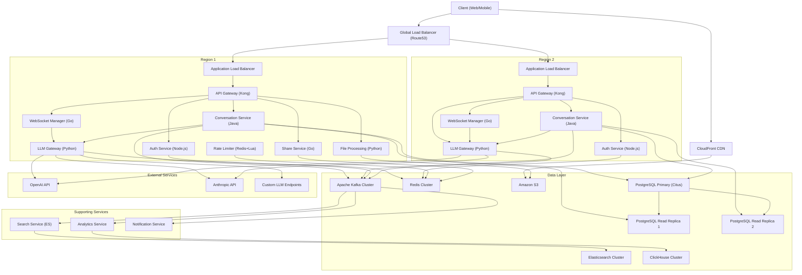
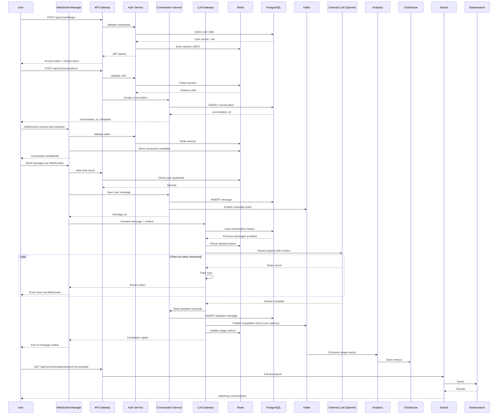

# ChatGPT-like Conversational AI Web Application - High-Level Design

> Generated by **claude-sonnet-4-5** (anthropic) on 2026-02-08T08:54:03.001Z
> Duration: 342837ms

## Overview

This system design outlines a globally distributed, highly scalable conversational AI platform capable of serving 20 million daily active users with 500 million messages per day. The architecture employs a microservices approach with dedicated services for authentication, conversation management, real-time streaming, and LLM orchestration. The design emphasizes low-latency streaming responses (sub-500ms time to first token), horizontal scalability to support 100K+ concurrent WebSocket connections per region, and robust fault tolerance with automatic LLM backend failover.

The system leverages a multi-region deployment with geographic load balancing, employs PostgreSQL with read replicas for durable conversation storage, Redis for session management and caching, and Kafka for asynchronous event processing. A dedicated LLM Gateway service abstracts multiple LLM providers (OpenAI, Anthropic, custom models), implements intelligent routing, rate limiting, and cost tracking. Real-time bidirectional communication is handled via WebSocket connections through a scalable connection manager, while a CDN delivers static assets and cached content globally.

## Requirements

### Functional
- User registration, login, and session management with JWT tokens
- Create, read, update, and delete conversation threads
- Multi-turn conversations with full context retention across messages
- Real-time streaming of LLM responses token-by-token via WebSocket
- Support for multiple LLM backends with user-selectable models
- Conversation history search and organization (folders, tags, timestamps)
- File upload and multimodal input processing (images, PDFs, documents)
- Generate shareable public links for conversations with privacy controls
- Markdown rendering support including code syntax highlighting
- Admin dashboard for usage analytics, cost monitoring, and user management
- Rate limiting based on user tier (free, pro, enterprise)
- Usage quota enforcement and billing integration

### Non-Functional
- Support 20 million daily active users and 500 million messages/day
- Time to first token (TTFT) must be under 500ms
- Handle 100K+ concurrent WebSocket connections per region
- 99.9% availability with automatic failover for LLM backend failures
- Conversation data must be immediately consistent and durable
- Horizontal scalability for all stateless services
- Geographic distribution across multiple regions for low latency
- Per-request cost tracking with 99.99% accuracy for billing
- Support message throughput of 5,800 messages/second sustained
- Data retention for at least 90 days with archival for older conversations
- Security compliance (encryption at rest and in transit, GDPR, SOC2)

## Architecture Diagram

## Components

### API Gateway

- **Responsibility:** Single entry point for all client requests; handles routing, authentication validation, rate limiting, request/response transformation, and SSL termination
- **Technology:** Kong Gateway with OpenResty (Nginx + Lua)
- **Justification:** Kong provides high-performance reverse proxy with built-in plugins for authentication, rate limiting, logging, and circuit breaking. Handles 10K+ RPS per instance with horizontal scalability and proven in production at scale.

### Authentication Service

- **Responsibility:** User registration, login, JWT token issuance and validation, OAuth integration, session management, and user profile management
- **Technology:** Node.js with Passport.js + Auth0 for identity management
- **Justification:** Auth0 provides enterprise-grade authentication with built-in security features, MFA, social login, and scales automatically. Node.js offers fast token validation and can handle 5K+ auth requests per second per instance.

### WebSocket Connection Manager

- **Responsibility:** Maintains persistent WebSocket connections, handles connection lifecycle, message routing, presence management, and broadcasts streaming responses to clients
- **Technology:** Go with Gorilla WebSocket library, deployed on Kubernetes with HPA
- **Justification:** Go excels at concurrent connection handling with lightweight goroutines. Each instance can handle 10K+ concurrent WebSockets with minimal memory overhead. Stateless design allows horizontal scaling based on connection count.

### Conversation Service

- **Responsibility:** CRUD operations for conversation threads, message persistence, context window management, conversation search, and thread organization
- **Technology:** Java Spring Boot with Spring Data JPA
- **Justification:** Spring Boot provides mature transaction management, excellent PostgreSQL integration, and strong consistency guarantees. JPA simplifies complex queries for conversation history and search. Battle-tested at enterprise scale.

### LLM Gateway Service

- **Responsibility:** Abstracts multiple LLM providers, routes requests to appropriate backends, handles streaming, implements retry logic with exponential backoff, tracks costs per request, and provides automatic failover
- **Technology:** Python with FastAPI and LangChain for LLM orchestration
- **Justification:** Python ecosystem has best LLM library support (OpenAI SDK, Anthropic SDK, transformers). FastAPI provides async streaming support essential for token-by-token delivery. LangChain simplifies multi-provider integration and context management.

### File Processing Service

- **Responsibility:** Handles file uploads, validates file types and sizes, extracts text from documents (OCR, PDF parsing), processes images for vision models, and stores files in object storage
- **Technology:** Python with Celery for async processing, Tesseract for OCR, PyPDF2 for PDF parsing
- **Justification:** Python has rich libraries for document processing and image manipulation. Celery provides distributed task queue for async processing of large files without blocking API responses. Can scale workers independently based on queue depth.

### Search Service

- **Responsibility:** Indexes conversation content, provides full-text search across message history, supports filtering by date, model, and tags
- **Technology:** Elasticsearch with custom analyzers for semantic search
- **Justification:** Elasticsearch provides sub-second full-text search across billions of documents. Supports complex queries, filtering, and aggregations. Can be extended with vector embeddings for semantic search. Scales horizontally with sharding.

### Rate Limiter Service

- **Responsibility:** Enforces per-user and per-tier rate limits, quota management, token bucket algorithm implementation, and communicates with billing service
- **Technology:** Redis with Lua scripts for atomic rate limiting operations
- **Justification:** Redis provides in-memory performance (<1ms latency) essential for rate limit checks on every request. Lua scripts ensure atomic operations for token bucket algorithms. Redis Cluster provides high availability and scales to millions of users.

### Analytics & Monitoring Service

- **Responsibility:** Collects usage metrics, tracks costs per request and per user, monitors system health, generates reports for admin dashboard
- **Technology:** ClickHouse for OLAP analytics with Grafana for visualization
- **Justification:** ClickHouse excels at high-volume time-series analytics with billions of rows, providing sub-second query performance for dashboards. Columnar storage reduces costs. Grafana provides rich visualization for admin dashboards.

### Notification Service

- **Responsibility:** Sends email notifications, push notifications, and in-app alerts for quota limits, system updates, and shared conversations
- **Technology:** Node.js with SendGrid for email, Firebase Cloud Messaging for push
- **Justification:** SendGrid provides reliable email delivery with analytics. FCM supports cross-platform push notifications. Node.js event-driven architecture handles high-volume async notifications efficiently.

### Share Service

- **Responsibility:** Generates unique shareable links for conversations, manages privacy settings and expiration, renders public conversation views
- **Technology:** Go with Redis for link metadata caching
- **Justification:** Go provides fast link generation and validation. Redis caches share metadata to avoid database lookups on every public link access. Stateless design allows easy scaling for viral shared conversations.

## Data Flow

## Data Storage

| Store | Type | Justification |
|-------|------|---------------|
| PostgreSQL 15 with Citus extension for horizontal sharding | sql | Primary datastore for users, conversations, messages, and relationships. Citus enables horizontal sharding by user_id to handle billions of messages. JSONB support for flexible message metadata. Strong ACID guarantees ensure conversation consistency. Read replicas handle query load. |
| Redis Cluster | cache | Multi-purpose: JWT session storage, rate limiting counters, conversation context caching, WebSocket connection metadata, and hot conversation cache. Sub-millisecond latency critical for rate limiting and session validation. Redis Cluster provides automatic sharding and replication. |
| Elasticsearch 8.x | search | Full-text search across conversation history. Handles complex queries with filters, highlighting, and relevance scoring. Inverted indexes provide fast search across billions of messages. Can be extended with kNN for semantic search using embeddings. |
| Amazon S3 with CloudFront CDN | blob | Stores uploaded files (images, documents), exported conversations, and shared conversation snapshots. S3 provides 99.999999999% durability, lifecycle policies for cost optimization, and versioning. CloudFront accelerates file delivery globally. |
| Apache Kafka | queue | Event streaming backbone for async processing: analytics events, usage tracking, cost calculation, audit logs, and notification triggers. Kafka provides durable message storage, replay capability, and scales to millions of events per second. Decouples producers from consumers. |
| ClickHouse | nosql | Time-series analytics database for usage metrics, cost tracking, and admin dashboards. Optimized for OLAP queries with aggregations across billions of rows. Columnar storage provides 10-100x compression. Real-time ingestion from Kafka. |

## API Design

| Method | Endpoint | Description |
|--------|----------|-------------|
| POST | `/api/v1/auth/register` | Register a new user account with email and password, returns JWT access and refresh tokens |
| POST | `/api/v1/auth/login` | Authenticate user credentials and issue JWT tokens with user tier information |
| POST | `/api/v1/conversations` | Create a new conversation thread, returns conversation_id and initial metadata |
| GET | `/api/v1/conversations/{conversation_id}` | Retrieve full conversation thread with all messages, supports pagination and filtering |
| POST | `/api/v1/conversations/{conversation_id}/messages` | Send a new message in a conversation, triggers LLM processing, returns message_id for tracking |
| WS | `/ws/v1/stream` | WebSocket endpoint for real-time bidirectional communication, streams LLM responses token-by-token, handles connection lifecycle |
| GET | `/api/v1/conversations/search` | Full-text search across user's conversation history with filters for date range, model, and tags |
| POST | `/api/v1/files/upload` | Upload files for multimodal input, supports images and documents up to 50MB, returns file_id and processing status |
| POST | `/api/v1/conversations/{conversation_id}/share` | Generate a public shareable link for a conversation with configurable expiration and privacy settings |
| GET | `/api/v1/models` | List available LLM models with capabilities, pricing, and context window information |
| GET | `/api/v1/users/me/usage` | Get current user's usage statistics, quota consumption, and rate limit status |
| GET | `/api/v1/admin/analytics/usage` | Admin endpoint for aggregated usage metrics, costs by model, and active user statistics |
| DELETE | `/api/v1/conversations/{conversation_id}` | Soft delete a conversation thread, marks as deleted but retains for recovery period |

## Scalability Strategy

**Horizontal Scaling Approach:**

1. **Stateless Services**: All application services (API Gateway, Conversation Service, LLM Gateway, Auth Service, WebSocket Manager) are stateless and containerized with Kubernetes. Auto-scaling policies based on CPU (70% threshold) and custom metrics (concurrent connections for WS Manager, queue depth for File Processing).

2. **WebSocket Connection Distribution**: Each WebSocket Manager instance handles 10K concurrent connections. With 100K target per region, deploy 10+ instances with sticky session routing at the load balancer level using consistent hashing on user_id. Connection metadata stored in Redis allows any instance to route messages.

3. **Database Sharding**: PostgreSQL with Citus extension shards data by user_id across 16 initial shards, expandable to 64+. Each shard handles ~1.25M users. Read replicas (3 per shard) distribute query load. Message tables partitioned by created_at (monthly) for efficient archival.

4. **LLM Gateway Scaling**: Python FastAPI instances scaled based on request queue depth in Kafka. Each instance maintains connection pools to external LLM APIs (OpenAI, Anthropic) with circuit breakers. Geographic proximity routing to LLM endpoints reduces latency.

5. **Caching Strategy**: Redis Cluster with 12 nodes (4 shards × 3 replicas) caches: conversation contexts (30min TTL), user sessions (24hr), rate limit counters (1hr sliding window), hot conversations (top 10% by access). Cache hit rate target: 85%+.

6. **Multi-Region Deployment**: Deploy across 3 regions (US-East, EU-West, Asia-Pacific) with Route53 geo-routing. Each region handles 7M DAU. Cross-region PostgreSQL replication (async) for disaster recovery. Kafka MirrorMaker 2 replicates events for analytics aggregation.

**Vertical Scaling Considerations:**

- PostgreSQL instances: Start with r6g.4xlarge (16 vCPU, 128GB RAM), scale to r6g.8xlarge for primary. Read replicas on r6g.2xlarge.
- Redis Cluster: r6g.xlarge nodes (4 vCPU, 32GB RAM per node).
- LLM Gateway: CPU-optimized c6i.2xlarge for fast Python execution.
- ClickHouse: Storage-optimized i3en.2xlarge for cost-effective analytics.

**Capacity Planning for 500M messages/day**: ~5,800 msgs/sec sustained, 12K msgs/sec peak. Each LLM Gateway instance handles 50 concurrent requests × 20 regions × 10 instances = 10K concurrent LLM requests. Over-provision by 50% for traffic spikes and failover capacity.

## Trade-offs

### WebSocket for real-time streaming vs Server-Sent Events (SSE)

**Pros:**
- Bidirectional communication allows client to cancel requests mid-stream
- Lower latency for streaming tokens (no HTTP overhead per message)
- Better for interactive features like typing indicators and presence
- Single persistent connection reduces connection overhead

**Cons:**
- More complex infrastructure with stateful connection management
- Requires sticky sessions and connection state tracking in Redis
- Harder to debug and monitor compared to stateless HTTP
- Load balancer configuration more complex (TCP vs HTTP)
- Higher memory consumption per connection on server side

### PostgreSQL with Citus sharding vs fully distributed database (Cassandra/DynamoDB)

**Pros:**
- Strong ACID guarantees ensure conversation consistency across multi-turn interactions
- Complex relational queries for conversation threads, user relationships, and search
- Mature ecosystem with excellent tooling, monitoring, and operational knowledge
- JSONB support provides schema flexibility for message metadata without sacrificing SQL
- Citus provides transparent sharding while maintaining PostgreSQL compatibility

**Cons:**
- Harder to scale writes compared to eventually consistent NoSQL databases
- Requires careful shard key selection (user_id) to avoid hot partitions
- Cross-shard queries (e.g., admin analytics) are more expensive
- Higher operational complexity for managing sharding compared to managed NoSQL
- Potential single points of failure if primary shard goes down (mitigated with replicas)

### Python FastAPI for LLM Gateway vs Go/Java

**Pros:**
- Best ecosystem for LLM libraries (OpenAI, Anthropic, LangChain, transformers)
- Native async/await support in FastAPI ideal for streaming responses
- Rapid development and easy integration with ML/AI tooling
- LangChain provides abstraction for multi-provider LLM orchestration
- Python's expressiveness reduces code complexity for prompt engineering

**Cons:**
- Lower raw throughput compared to Go or Java (GIL limitations)
- Higher memory consumption per request (~50MB vs ~5MB for Go)
- Slower cold start times if using serverless deployment
- Requires more instances to achieve same throughput as compiled languages
- Dependency management more fragile (pip vs Go modules)

### Kafka for event streaming vs direct database writes with triggers

**Pros:**
- Decouples message processing from analytics, allowing independent scaling
- Event replay capability for backfilling analytics or debugging
- Enables multiple consumers (analytics, search indexing, notifications) without coupling
- Buffer for traffic spikes - prevents overwhelming downstream systems
- Provides audit log for compliance and debugging

**Cons:**
- Additional infrastructure complexity and operational overhead
- Eventual consistency - analytics may lag real-time by seconds
- Higher storage costs for event retention (30 days = ~15TB for 500M msgs/day)
- Requires monitoring for consumer lag and rebalancing
- Increases overall system latency for end-to-end event processing

### Multi-region active-active deployment vs active-passive

**Pros:**
- Lower latency for global users by serving from nearest region
- Higher availability - no failover delay if region goes down
- Better resource utilization - all regions handle traffic simultaneously
- Enables geographic compliance (EU data stays in EU region)

**Cons:**
- Complex data consistency challenges for global user state (sessions, rate limits)
- Higher infrastructure costs running full stack in multiple regions
- Cross-region latency for database replication can cause eventual consistency issues
- More complex deployment and testing (must validate across all regions)
- Potential for split-brain scenarios if network partitions occur

### Redis for rate limiting vs database-based rate limiting

**Pros:**
- Sub-millisecond latency critical for checking limits on every request
- Atomic operations with Lua scripts prevent race conditions in token bucket algorithm
- In-memory performance scales to millions of rate limit checks per second
- TTL support automatically cleans up expired rate limit windows
- Doesn't add load to primary transactional database

**Cons:**
- Data loss risk if Redis instance fails (mitigated with Redis Cluster replication)
- Higher cost per GB compared to disk-based storage
- Requires separate infrastructure component to maintain and monitor
- Complex to guarantee exactly-once semantics during failover scenarios
- Memory constraints may require eviction policies that could lose rate limit state
