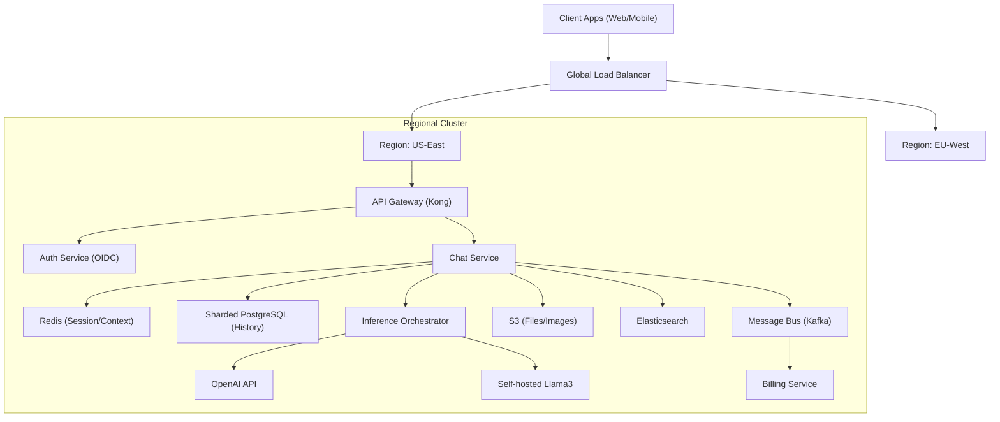
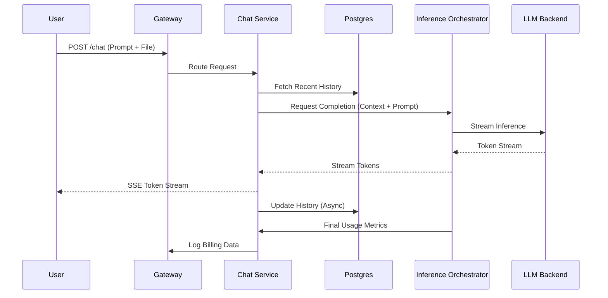

# Scalable LLM Chat Platform Architecture

> Generated by **gemini-3-flash-preview** (gemini) on 2026-02-08T08:22:44.191Z
> Duration: 39436ms

## Overview

This system design describes a globally distributed, high-concurrency platform similar to ChatGPT, capable of handling 20M DAU and 500M messages per day. The architecture focuses on low-latency streaming (TTFT < 500ms), immediate consistency for conversation history, and high availability across multiple LLM backends through an intelligent inference orchestration layer. It utilizes an event-driven model for background tasks like cost tracking and search indexing, while maintaining persistent connections for real-time interaction.

## Requirements

### Functional
- User authentication and session management
- Multi-turn conversation with stateful context management
- Real-time token streaming via Server-Sent Events (SSE)
- Global conversation search and organization
- Support for multiple LLM providers (OpenAI, Anthropic, internal models)
- Multimodal support (Image/Document processing)
- Public conversation sharing via UUID-masked URLs
- Admin monitoring for cost and model performance

### Non-Functional
- Scale: 20 million daily active users
- Latency: Time To First Token (TTFT) under 500ms
- Concurrency: 100k+ active connections per region
- Durability: Immediate consistency for conversation storage
- Reliability: Automatic failover between LLM backends
- Scalability: Horizontal scaling for all stateless services

## Architecture Diagram

## Components

### Global Load Balancer

- **Responsibility:** Routes traffic to the nearest geographic region and handles SSL termination.
- **Technology:** Google Cloud Load Balancing or AWS Global Accelerator
- **Justification:** Provides low-latency entry points and sophisticated health-checking across global regions.

### Edge Gateway / API Gateway

- **Responsibility:** Handles authentication, rate limiting (per-tier), and request routing.
- **Technology:** Kong or Envoy
- **Justification:** High-performance proxy that supports custom plugins for quota management and JWT validation.

### Chat & Context Service

- **Responsibility:** Orchestrates chat logic, manages conversation state, and formats prompts.
- **Technology:** Go (Golang)
- **Justification:** Golang's concurrency model (goroutines) is ideal for managing thousands of simultaneous streaming connections with low memory overhead.

### Inference Orchestrator

- **Responsibility:** Routes requests to LLM backends, handles retries, circuit breaking, and failover.
- **Technology:** Custom microservice (Python/FastAPI or Go)
- **Justification:** Decouples the chat logic from specific LLM APIs, allowing for dynamic weight shifting and cost optimization.

### Streaming Engine

- **Responsibility:** Maintains persistent connections for pushing tokens to the client.
- **Technology:** Server-Sent Events (SSE) over HTTP/2
- **Justification:** SSE is more efficient than WebSockets for unidirectional streaming from server to client and handles reconnections natively.

### Usage & Billing Service

- **Responsibility:** Tracks token consumption and costs per user/request for real-time quota enforcement.
- **Technology:** Apache Flink
- **Justification:** Required for real-time stream processing of token counts to prevent over-usage beyond quotas.

## Data Flow

## Data Storage

| Store | Type | Justification |
|-------|------|---------------|
| PostgreSQL (with Citus) | sql | Ensures ACID compliance and immediate consistency for chat history. Citus allows horizontal sharding to handle 500M messages/day. |
| Redis | cache | Used for session management and caching recent conversation context to minimize DB hits during active turns. |
| Elasticsearch | search | Provides full-text search capabilities over millions of conversations with complex filtering (by date, model, or folder). |
| Amazon S3 / Google Cloud Storage | blob | Durable storage for multimodal inputs (images, PDF documents) and exported chat logs. |
| Apache Kafka | queue | Decouples chat streaming from analytical/billing tasks. Ensures that slow storage or billing updates do not block the user response. |

## API Design

| Method | Endpoint | Description |
|--------|----------|-------------|
| POST | `/v1/auth/login` | Authenticates user and returns a JWT session token. |
| POST | `/v1/chat/completions` | Primary endpoint for sending messages. Supports 'stream: true' for SSE responses. |
| GET | `/v1/conversations` | Retrieves a paginated list of the user's conversation history. |
| POST | `/v1/conversations/{id}/share` | Generates a public, read-only URL for a specific conversation thread. |
| POST | `/v1/files/upload` | Uploads multimodal content; returns a file ID for inclusion in chat completions. |
| GET | `/v1/models` | Lists available LLM backends and their specific capabilities (e.g., vision, long context). |

## Scalability Strategy

The system scales horizontally at the service level using Kubernetes. The Chat Service and Inference Orchestrator are stateless, allowing auto-scaling based on CPU/Memory and concurrent connection counts. Database scalability is achieved through PostgreSQL sharding on 'user_id' to ensure data locality for a single user's history. Regional data isolation is used to meet 100k connection requirements per region, while a global Redis layer or DB replication handles shared state like public links.

## Trade-offs

### SSE over WebSockets

**Pros:**
- Lower overhead on the server
- Better support for HTTP/2 multiplexing
- Built-in reconnection logic

**Cons:**
- Unidirectional (server to client) only
- Requires separate REST calls for client-side interruptions

### Sharded PostgreSQL for History

**Pros:**
- Strong consistency for conversation turns
- Relational schema fits organized folders/tags well

**Cons:**
- More complex to manage than NoSQL like DynamoDB
- Requires careful shard key selection to avoid hotspots

### Inference Orchestrator Abstraction

**Pros:**
- Seamless failover between providers
- Centralized cost and rate limit tracking

**Cons:**
- Additional network hop (approx 10-20ms latency)
- Single point of failure if not properly redundant
