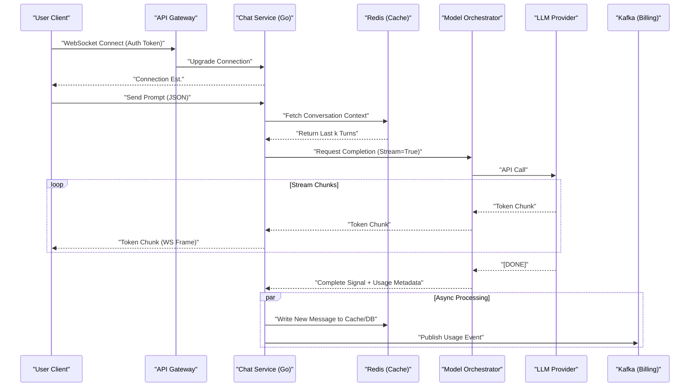

# High-Scale Conversational AI Platform Design

> Generated by **gemini-3-pro-preview** (gemini) on 2026-02-08T08:25:11.098Z
> Duration: 85320ms

## Overview

A distributed, event-driven architecture designed to support 20M+ DAU for a ChatGPT-like application. The system leverages persistent WebSocket connections for low-latency streaming (TTFT < 500ms), a Model Orchestration Layer to abstract various LLM backends, and a tiered storage strategy (Redis -> DynamoDB -> S3) to handle the high write throughput of 500M messages per day. The design prioritizes interactivity and durability while ensuring strict cost governance and rate limiting.

## Requirements

### Functional
- User authentication (SSO, MFA) and session management.
- Real-time streaming of LLM responses via WebSockets.
- Multi-turn conversation context management.
- Model switching (e.g., GPT-4, Claude, Llama 3) per conversation.
- Multimodal input handling (Images, PDF upload) via S3.
- Conversation history management (Create, Rename, Delete, Archive).
- Full-text search across conversation history.
- Public link generation for sharing conversations.
- Admin dashboard for cost tracking and user management.

### Non-Functional
- Latency: Time to First Token (TTFT) < 500ms.
- Concurrency: Support 100k+ active WebSocket connections per region.
- Availability: 99.99% uptime with multi-region failover.
- Scalability: Horizontal scaling to handle 500M messages/day.
- Durability: Zero data loss for conversation history.
- Consistency: Immediate consistency for active chat, eventual consistency for search.
- Billing Accuracy: Precise token counting for usage quotas.

## Architecture Diagram

```mermaid
graph TD
    User(("User Client"))
    CDN["CDN (Cloudfront)"]
    LB["Load Balancer (ALB)"]
    
    subgraph ClusterK8s[""Cluster (K8s)""]
        GW["API Gateway (Kong)"]
        Auth["Auth Service"]
        Chat["Chat Service (Go/WS)"]
        Context["Context Assembler"]
        Orch["Model Orchestrator"]
        Workers["Async Workers"]
    end
    
    subgraph "Data Layer"
        Redis["Redis Cluster (Hot Context)"]
        DDB[" (DynamoDB - Chat History) "]
        S3["S3 (Media/Uploads)"]
        ES["Elasticsearch (History Search)"]
        Kafka["Kafka (Event Bus)"]
    end

    User --> CDN
    User --> LB
    LB --> GW
    GW --> Auth
    GW --> Chat
    
    Chat --> Redis
    Chat --> Context
    Context --> Redis
    Context --> DDB
    Chat --> Orch
    
    Orch --> ExternalLLM["External LLM APIs"]
    Orch --> SelfHosted["Self-Hosted Models"]
    
    Chat -.-> Kafka
    Kafka --> Workers
    Workers --> ES
    Workers --> DDB
    
    User -- "Uploads" --> S3
```

## Components

### Edge Gateway / API Gateway

- **Responsibility:** SSL termination, Geo-routing, Rate limiting, Authentication verification.
- **Technology:** AWS Application Load Balancer + Kong Gateway
- **Justification:** Kong provides robust plugin support for rate-limiting (Token Bucket) and JWT validation before traffic hits internal services.

### Connection Manager (Chat Service)

- **Responsibility:** Manages WebSocket connections, broadcasts stream chunks, handles user state.
- **Technology:** Go (Golang) on Kubernetes
- **Justification:** Go's Goroutines are ideal for handling hundreds of thousands of concurrent WebSocket connections with low memory footprint compared to Node.js or Python.

### Model Orchestrator

- **Responsibility:** Standardizes API calls to different LLM providers, handles retry logic, and failover.
- **Technology:** Python (FastAPI) with LangChain adapters
- **Justification:** Python ecosystem has the best libraries for LLM integration. Isolating this allows independent scaling based on inference latency.

### Context Assembly Service

- **Responsibility:** Retrieves relevant chat history and injects system prompts/RAG context before inference.
- **Technology:** Rust Microservice
- **Justification:** Requires extremely low latency to fetch and tokenize text before sending to the LLM to meet the 500ms TTFT constraint.

### Billing & Analytics Consumer

- **Responsibility:** Consumes completed message events to calculate costs and update quotas.
- **Technology:** Apache Flink
- **Justification:** Stateful stream processing needed to aggregate token usage in real-time for strict quota enforcement.

## Data Flow



## Data Storage

| Store | Type | Justification |
|-------|------|---------------|
| Amazon DynamoDB | nosql | Primary store for Chat History. Supports massive write throughput (500M msgs/day) and efficient querying by Partition Key (ConversationID) and Sort Key (Timestamp). |
| Redis Cluster | cache | Stores active session state, recent conversation context (window), and user rate limit counters to minimize latency on the critical path. |
| Amazon S3 | blob | Storage for user-uploaded images/documents. Low cost, high durability, and allows offloading bandwidth via Presigned URLs. |
| PostgreSQL | sql | Stores structured relational data: User profiles, Organization hierarchies, Billing Invoices, and configuration settings. |
| Elasticsearch / OpenSearch | search | Provides full-text search capabilities over chat history, which DynamoDB cannot handle efficiently. |

## API Design

| Method | Endpoint | Description |
|--------|----------|-------------|
| WS | `/ws/v1/chat` | Main WebSocket endpoint for bi-directional streaming of prompts and LLM responses. |
| POST | `/v1/conversations` | Creates a new conversation thread, returns conversation_id. |
| GET | `/v1/conversations/{id}/messages` | Retrieves paginated message history for a specific conversation. |
| GET | `/v1/models` | Lists available LLM models user is authorized to use. |
| POST | `/v1/files/upload-url` | Generates a presigned S3 URL for uploading images or documents. |

## Scalability Strategy

Horizontal scaling via Kubernetes HPA based on CPU and custom metrics (Active WebSocket Connections). Database scales via DynamoDB On-Demand capacity or provisioned capacity with auto-scaling. The system is sharded by ConversationID for data locality. Redis Cluster handles hot-path reads. A Queue-based decoupling (Kafka) allows background tasks (search indexing, analytics) to scale independently of the real-time chat service.

## Trade-offs

### WebSockets over Server-Sent Events (SSE)

**Pros:**
- Bi-directional capability allows users to interrupt generation mid-stream.
- Better support for future features like real-time voice or collaborative editing.

**Cons:**
- More complex load balancing and state management on the server.
- Issues with corporate firewalls compared to standard HTTP/SSE.

### DynamoDB for History (NoSQL) vs PostgreSQL

**Pros:**
- Predictable low-latency performance at infinite scale (20M DAU).
- Schema flexibility for evolving message metadata (e.g., adding citations).

**Cons:**
- Complex queries (e.g., search) are impossible, requiring a secondary indexer (Elasticsearch).
- Higher cost per GB compared to compressed cold storage in SQL/S3.

### Async Token Counting (Post-generation)

**Pros:**
- Does not add latency to the streaming response.
- Simplifies the hot path architecture.

**Cons:**
- Risk of minor quota overages if a user spams requests before the counter updates.
- Complexity in reconciling partial streams if a connection drops.
