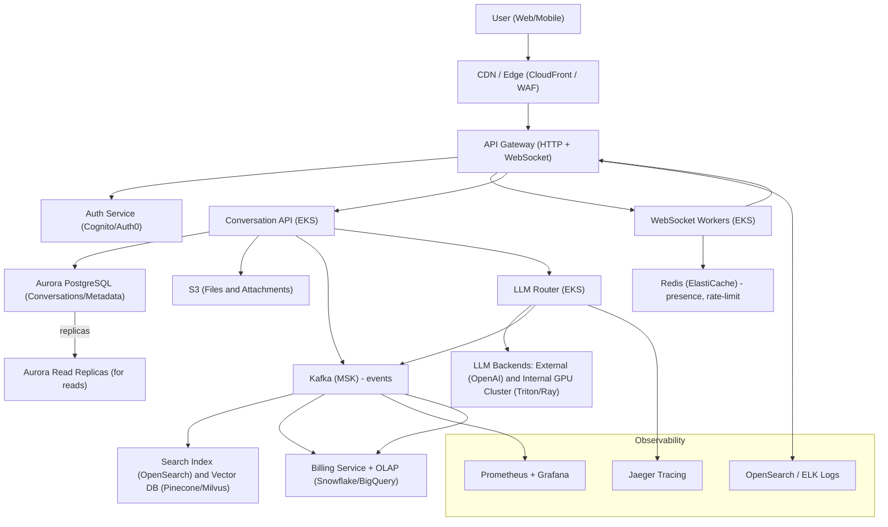
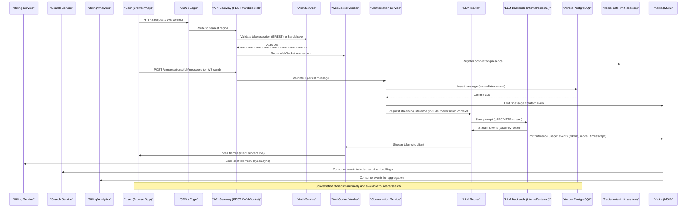

# High-Level Design: ChatGPT-like Multi-turn Conversational Platform

> Generated by **gpt-5-mini** (openai) on 2026-02-08T05:27:24.045Z
> Duration: 138269ms

## Overview

A globally distributed, real-time web platform that enables multi-turn conversations with configurable LLM backends, streaming responses token-by-token, durable conversation history, multimodal inputs, per-user quotas and billing, and admin monitoring. The design uses managed cloud components where appropriate (AWS examples used for concreteness) and is built for 20M DAU and ~500M messages/day — with multi-region deployment, autoscaling WebSocket clusters, strong consistency for conversation data, semantic search, and resilient LLM backend routing with automatic failover and cost accounting.

## Requirements

### Functional
- User authentication, registration, password reset and session management
- Create and continue multi-turn conversation threads with context retention
- Real-time streaming of LLM responses token-by-token to clients
- Durable and immediately consistent conversation history (read/write immediately consistent)
- Search and organize conversation history (text + semantic search)
- Support multiple LLM backends and per-conversation model selection
- Rate limiting and per-tier usage quotas; block/soft-limit enforcement
- Markdown rendering with safe sanitization (code blocks, tables, etc.)
- File upload and multimodal input handling (images, documents) with safe storage and processing
- Share conversations via public links (read-only) with optional expiry
- Admin dashboard for usage, costs, quota management, and system health
- Per-request cost tracking for accurate billing

### Non-Functional
- Scale to 20M daily active users and 500M messages/day
- Support at least 100K concurrent WebSocket connections per region
- Start streaming first token within 500ms of request
- Conversation history must be durable and immediately consistent
- High availability and graceful degradation on LLM backend failures with automatic failover
- Low latency (P95 request response times within reasonable bounds) and high throughput
- Secure file handling, sanitization, and access controls
- Observability: request tracing, per-request cost telemetry, metrics and logs
- Regulatory considerations: data residency and GDPR-friendly features (export/delete)

## Architecture Diagram

## Components

### Edge / CDN

- **Responsibility:** Global caching, TLS termination, hosting static assets, and routing to nearest API region. Protect against DDoS and serve prerendered content.
- **Technology:** AWS CloudFront + AWS WAF (or Cloudflare) for global CDN & edge security
- **Justification:** Low latency global content delivery and edge protections. CloudFront integrates with regional ALBs and AWS API Gateway; WAF provides DDoS/IPS rules.

### API Gateway (REST & WebSocket)

- **Responsibility:** Ingress point for HTTP(S) REST APIs and managed WebSocket connections, authentication/authorization integration, metrics, and throttling.
- **Technology:** AWS API Gateway (HTTP/APIGW v2 for WebSocket) or AWS Application Load Balancer + NLB for WebSocket if custom stack preferred
- **Justification:** Managed API Gateway handles large scale WebSocket connections reliably and integrates with Lambda and VPC targets. Reduces operational burden to meet 100K+ connections per region.

### Auth Service / Identity

- **Responsibility:** User authentication (email/password, OAuth), session issuance, token lifecycle, MFA, and account management.
- **Technology:** Auth0 or Amazon Cognito (or self-hosted Keycloak for more control)
- **Justification:** Managed identity reduces time to market; Cognito/Auth0 handle scaling, OIDC/OAuth flows, social login, and integrate with API Gateway and IAM. Can fallback to Keycloak if self-hosting required for compliance.

### Frontend (Web & Mobile clients)

- **Responsibility:** UI for conversations, streaming UI, markdown rendering/sanitization, file uploads, sharing links, offline behaviors, and websocket clients.
- **Technology:** React + Next.js for Web (SSR), React Native for mobile; use WebSocket & SSE clients for streaming. Use remark/rehype for markdown rendering and DOMPurify for sanitization.
- **Justification:** Next.js gives performant SSR/CSR mix and edge support; well-supported libraries for markdown and security.

### Connection Manager / WebSocket Workers

- **Responsibility:** Maintain WebSocket connections, route tokens to clients, enforce per-connection rate limits, maintain ephemeral state, and connect to LLM streaming output.
- **Technology:** Kubernetes (EKS) running horizontally scaled WebSocket worker pods behind API Gateway or ALB, using Envoy/ingress for routing. Use Redis for presence/connection metadata.
- **Justification:** Kubernetes provides autoscaling and lifecycle control. Breaking stream work into worker pods allows streaming token-by-token with low-latency writes to sockets; Redis stores connection mapping for routing in multi-pod deployments.

### Conversation Service (API)

- **Responsibility:** Handles conversation CRUD, multi-turn context assembly, versioning, bookmarks, shareable link creation, and immediate persistent writes.
- **Technology:** Stateless microservice in Kubernetes (gRPC/HTTP) with connection to Aurora PostgreSQL (Primary writer) and a caching layer (Redis).
- **Justification:** Stateless services scale easily. Aurora PostgreSQL provides strong consistency and supports high write throughput with multi-AZ. Redis accelerates hot path reads and rate-limit checks.

### Message Ingest & Streaming Orchestrator (LLM Router)

- **Responsibility:** Orchestrates sending prompts to selected LLM backend(s), streams tokens back to Connection Manager, calculates per-request cost, applies circuit-breakers and failover to alternate models/backends, and logs telemetry.
- **Technology:** Stateless microservice (Kubernetes) using gRPC to LLM backends; feature-rich router capability using Hystrix-like circuit breaker libraries and per-model adapters. Persist logs & events to Kafka (MSK) for downstream processing.
- **Justification:** Centralized routing simplifies failover, cost accounting, and policy enforcement. gRPC yields low-latency backend calls; Kafka provides durable eventing for billing and analytics.

### LLM Backends

- **Responsibility:** Provide model inference and token streaming. Could be managed external APIs (OpenAI, Anthropic) and/or internal GPU clusters (private models).
- **Technology:** Hybrid: External providers (OpenAI/Anthropic) + Internal GPU clusters orchestrated by Kubernetes + Triton / NVIDIA TensorRT / Ray Serve for model serving. Use model proxies that expose gRPC or HTTP streaming.
- **Justification:** Hybrid provides capacity and cost controls: external for burst/spiky loads and internal for steady-state/private models. Triton/Ray Serve are production-ready for large model serving with streaming support.

### Cache & Rate-Limit Store

- **Responsibility:** Fast token-bucket rate limits, session cache, short-lived conversation caches for hot reads, and presence store.
- **Technology:** Redis (Amazon ElastiCache in clustered mode with clustering-enabled Redis or Redis Enterprise)
- **Justification:** Redis supports very low-latency operations, atomic counters, Lua scripting for rate-limiting logic, and clustering for scale.

### Durable Storage (Conversations / Metadata / Billing)

- **Responsibility:** Immediate-consistency primary store for conversations, messages, user metadata, billing records, and access controls.
- **Technology:** Amazon Aurora PostgreSQL (clustered, multi-AZ, read-replicas) with partitioning/sharding by tenant or hashed conversation id.
- **Justification:** Relational strong consistency and transactions for immediate-consistency requirement; Aurora scales reads and provides high durability and automated backups.

### Object Store (Files & Attachments)

- **Responsibility:** Store uploaded files (images, docs) and serve them to model pipelines and clients via presigned URLs; lifecycle & virus-scan results.
- **Technology:** Amazon S3 with S3 Object Lambda hooks; presigned uploads; Lambda for scanning via ClamAV or third-party virus scanning
- **Justification:** S3 is durable, scalable, and cost-effective; presigned uploads offload bandwidth; Lambda-based scanning pipeline can be used asynchronously.

### Search & Embeddings

- **Responsibility:** Text and semantic search across conversation history and attachments; embedding generation and vector search.
- **Technology:** Hybrid: OpenSearch (for keyword/structured search) + Vector DB (Pinecone, Milvus, or Amazon OpenSearch vector plugin) for embeddings. Use a managed embedding service or produce embeddings via dedicated model instances and store vectors in vector DB.
- **Justification:** OpenSearch handles traditional search and filters; vector DB supports semantic similarity at scale. Separating concerns lets us scale search independently.

### Event Bus / Streaming & Analytics

- **Responsibility:** Durable eventing for audit logs, billing events, metrics, and asynchronous jobs (indexing, notifications, cost aggregation).
- **Technology:** Apache Kafka (Amazon MSK) for high-throughput durable logs; Kafka Connect to data warehouse (Snowflake/BigQuery) and stream processors (Flink/Kafka Streams).
- **Justification:** Kafka scales well for hundreds of thousands of events/sec and supports exactly-once processing patterns enabling accurate billing and analytics.

### Billing & Cost Accounting

- **Responsibility:** Accurate per-request cost tracking, aggregation to user billing, tier enforcement, and exports to billing system.
- **Technology:** Service that consumes Kafka billing events, applies per-model cost rates, stores detailed line-items in PostgreSQL and aggregates in OLAP (BigQuery/Snowflake) for reports. Use serverless ETL for daily aggregation.
- **Justification:** Event-driven accounting keeps near-real-time cost tracking for each request; OLAP enables fast analytics and admin dashboards.

### Admin Dashboard & Observability

- **Responsibility:** System metrics, alerts, per-user/tier usage, cost dashboards, model-health, and structured logs.
- **Technology:** Prometheus + Grafana for metrics; Jaeger for distributed traces; ELK/OpenSearch for logs; Grafana dashboards with role-based access. Admin frontend built on React + RBAC.
- **Justification:** Standard observability stack with tracing allows operators to debug and monitor the system and analyze cost/usage.

### Security & Compliance

- **Responsibility:** Access controls, secret management, key rotation, audit logs, data deletion/export endpoints, encryption at rest/in transit, and DLP for file scanning.
- **Technology:** AWS KMS for secrets, IAM for infra access control, Vault (HashiCorp) for application secrets if self-hosting; S3 encryption and TLS everywhere.
- **Justification:** Managed key stores and RBAC minimize operational overhead while meeting compliance.

## Data Flow

## Data Storage

| Store | Type | Justification |
|-------|------|---------------|
| Amazon Aurora PostgreSQL | sql | Provides immediate consistency, transactions, and durability for conversation history and billing line-items. Aurora supports multi-AZ, read-replicas, partitioning/sharding, and scales to high throughput with proper schema design. |
| Redis (ElastiCache Clustered) | cache | Low-latency data for rate-limiting, session/presence mapping, token-bucket counters, and ephemeral caching of recent conversation context for fast reads. |
| Amazon S3 | blob | Durable, cost-efficient object storage for user uploaded files and model artifacts. Supports presigned uploads and lifecycle policies; integrates with object-lambda for scanning/transformations. |
| Apache Kafka (Amazon MSK) | queue | Durable, high-throughput event stream for message events, billing events, and indexing streams. Enables decoupled asynchronous processing (search indexing, billing aggregation, analytics). |
| OpenSearch (Elastic) + Vector DB (Pinecone or Milvus) | search | OpenSearch for keyword/structured search and filters; vector DB for semantic similarity search on embeddings. Scales independently and supports fast retrieval of relevant conversation segments. |
| OLAP (BigQuery or Snowflake) | nosql | For cost/billing analytics and historical reporting at scale. Stores aggregated billing/usage records and enables fast analytics for admin dashboards and finance exports. |

## API Design

| Method | Endpoint | Description |
|--------|----------|-------------|
| POST | `/api/v1/auth/login` | Authenticate user (email/password or OAuth token exchange). Returns access token and refresh token. Initiates session and rate-limit metadata. |
| GET | `/api/v1/conversations` | List user conversations with pagination, sorting, and filters (by tag, model, shared). Uses read-replica; consistent with write-through caching invalidation. |
| POST | `/api/v1/conversations` | Create a new conversation; specify model, system prompt, privacy/sharing options, and optional attachments. |
| POST | `/api/v1/conversations/{conversationId}/messages` | Send a new user message to a conversation. Persists message, triggers inference via LLM Router, and returns inference-id. Supports multimodal references (file IDs). |
| WS | `/api/v1/conversations/{conversationId}/stream` | WebSocket endpoint for real-time streaming of LLM responses (token-by-token) and message events. Supports client acknowledgements, reconnect/resume semantics, and server pings. |
| POST | `/api/v1/files` | Request presigned URL for upload or upload metadata. After upload, file is scanned asynchronously; returns file ID for model input. |
| GET | `/api/v1/models` | List available models with capabilities, estimated cost/token, latency SLAs, and fallback rules. |
| POST | `/api/v1/conversations/{conversationId}/share` | Create a public, shareable link (read-only) with optional expiry and password protect settings. |
| GET | `/api/v1/admin/metrics` | Admin-only metrics endpoint aggregated from Prometheus/OLAP for usage, costs, model health, and alerts. Requires admin RBAC. |

## Scalability Strategy

Multi-region deployment with region-local clusters (API Gateway + EKS + Aurora in each region or read-only replicas cross-region depending on data residency). Horizontal scaling: stateless frontends and LLM Router scale via Kubernetes HPA/KEDA based on CPU/RPS/queue length. WebSocket workers scale horizontally; use managed API Gateway or ALB to handle connection scaling. Redis is scaled as a clustered ElastiCache with sharding; Aurora can be scaled by sharding conversations by tenant or hashing conversationId to different writer clusters for write throughput. Use Kafka (MSK) partitions scaled by throughput and consumer groups for parallel processing. Use autoscaling GPU pools for internal model serving (using Karpenter/Cluster Autoscaler) and spot instances to reduce cost for non-critical capacity. Employ edge caching (CloudFront) for static assets and read-heavy metadata. For search and embeddings, scale vector DB clusters independently. For global throughput, employ traffic steering to nearest region with failover and active-passive or active-active DB strategy where legal/regulatory constraints permit.

## Trade-offs

### Use Aurora PostgreSQL (SQL) as primary conversation store versus a NoSQL store

**Pros:**
- Strong consistency and transactional integrity meeting immediate-consistency requirement
- Familiar SQL tooling for analytics and billing joins
- ACID semantics make concurrency around multi-turn context safer

**Cons:**
- Higher cost at scale and more complex sharding strategy required for very high write throughput
- Scaling writes requires sharding/partitioning; operational complexity compared to unlimited-scaled NoSQL

### Managed API Gateway + managed WebSocket vs self-hosted WebSocket tier

**Pros:**
- Reduces operational burden and more predictable scalability to meet 100K+ connections per region
- Integrated auth/metrics and DDoS protections

**Cons:**
- Potentially higher cost and less low-level customization than self-hosted approach
- Proprietary limits and vendor lock-in

### Hybrid LLM Backends (external providers + internal GPU clusters)

**Pros:**
- Flexibility: use cheaper internal models for baseline load and external providers for burst or advanced models
- Avoids total dependency on third-party providers and gives control over privacy/compliance

**Cons:**
- Complexity in routing, capacity planning, and maintaining model infra
- Potentially higher ops cost to run GPU clusters

### Kafka (MSK) for events vs serverless queues (Kinesis/Lambda)

**Pros:**
- Kafka provides high throughput, ordering guarantees, and complex stream processing needed for billing accuracy
- Good for exactly-once or at-least-once semantics required by billing and audit trails

**Cons:**
- Operational complexity and higher management overhead vs serverless alternatives
- Higher cost at small scale; more moving parts

### Use Redis for rate-limiting and session store

**Pros:**
- Extremely low latency and atomic operations (Lua) for precise rate-limiting
- Widely adopted pattern and straightforward to implement token-bucket quotas

**Cons:**
- Single point of failure risk if not configured in clustered/high-availability mode
- Operational overhead to scale and tune eviction/persistence

### Vector DB (Pinecone/Milvus) for semantic search vs using OpenSearch alone

**Pros:**
- Vector DB optimized for nearest-neighbor semantic search at scale and supports high-dimensional vectors
- Better latency and scalability for similarity queries

**Cons:**
- Adds another datastore to maintain and sync embeddings (operational overhead)
- Extra cost; integration complexity with indexing pipelines
