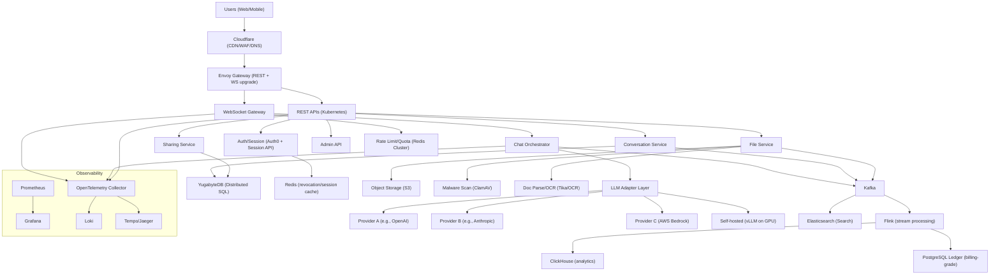
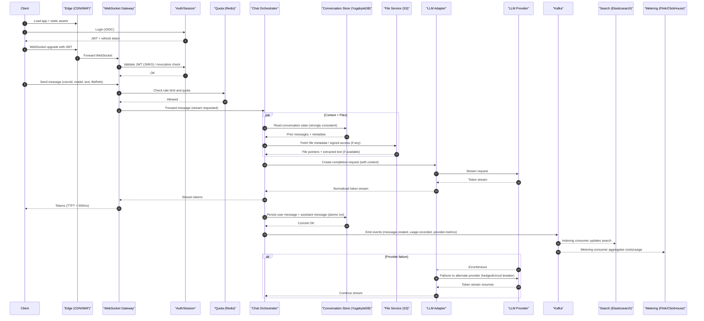

# ChatGPT-like Web Application (Multi-turn, Streaming, Multimodal, Multi-Model) — High-Level Design

> Generated by **gpt-5.2** (openai) on 2026-02-08T08:29:52.597Z
> Duration: 220966ms

## Overview

The system is a globally distributed, multi-tenant conversational AI web application supporting authenticated users, multi-turn threads, token-streaming responses, file/multimodal inputs, conversation search, sharing links, and an admin cost/usage dashboard. It is designed for 20M DAU and ~500M messages/day with strict latency requirements (TTFT < 500ms) and high concurrency (>=100K concurrent WebSocket connections per region).

The architecture separates the latency-critical request/streaming path (WebSocket Gateway + Orchestrator + LLM adapters) from durable storage, indexing, analytics, and billing pipelines. Conversations are stored in a strongly consistent SQL store, while search and analytics are powered by specialized systems. LLM backend failures are handled via circuit breakers, hedged requests, and provider failover with per-token streaming preserved.

## Requirements

### Functional
- User authentication (SSO/email), session management, and tier entitlements
- Create/read/update conversation threads with multi-turn context retention
- Real-time token-by-token streaming of assistant responses to the client
- Model selection per conversation/message across multiple LLM backends
- Conversation history browsing, organization (folders/tags), and search
- File upload (images/documents) and multimodal prompts
- Share conversations via public links with optional redaction/permissions
- Rate limiting and usage quotas per user/tier with enforcement
- Markdown rendering support (code blocks, tables) and safe sanitization
- Admin dashboard for monitoring usage, latency, errors, and costs

### Non-Functional
- Scale: 20M DAU, 500M messages/day, avg 10 turns/conversation
- Latency: streaming must start within 500ms time-to-first-token
- Concurrency: >=100K concurrent WebSocket connections per region
- Durability + immediate consistency for conversation history
- High availability with automatic failover across LLM providers/regions
- Accurate per-request/per-token cost tracking for billing
- Security: encryption in transit/at rest, least privilege, audit logs
- Compliance readiness (PII controls, retention policies, GDPR delete)
- Operational excellence: observability, alerting, safe deploys (canary)
- Abuse prevention: bot detection, prompt injection/file malware scanning

## Architecture Diagram

## Components

### Web Client (Browser) + Mobile

- **Responsibility:** UI for chat, conversation list, model selection, file upload, markdown rendering, and real-time streaming display via WebSocket/SSE fallback.
- **Technology:** Next.js (React) + TypeScript; Markdown-it + DOMPurify; WebSocket client
- **Justification:** Next.js supports SSR/SPA, fast iteration, and edge-friendly deployments. Markdown-it is extensible for code blocks/tables; DOMPurify prevents XSS. WebSocket enables low-latency bidirectional streaming.

### Global DNS + CDN/WAF

- **Responsibility:** Global traffic steering, TLS termination at edge, DDoS protection, caching of static assets, WAF rules, and bot mitigation.
- **Technology:** Cloudflare (DNS, CDN, WAF, Bot Management)
- **Justification:** Strong global presence reduces latency and protects origin. Bot/DDoS controls are critical at 20M DAU.

### API Gateway / Edge

- **Responsibility:** Routing for REST APIs and WebSocket upgrades, auth pre-checks, request shaping, and regional failover.
- **Technology:** Envoy Gateway (Kubernetes) + Cloudflare origin rules
- **Justification:** Envoy provides high-performance L7 routing, retries, timeouts, and observability. Works well with WebSockets and service mesh patterns.

### Auth & Session Service

- **Responsibility:** User signup/login, OAuth/OIDC, session issuance, refresh, MFA support, and entitlement lookup for tiers.
- **Technology:** Auth0 (OIDC) + internal Session API using JWT (short-lived) + Redis for session revocation
- **Justification:** Auth0 reduces security risk and time-to-market. Short-lived JWT minimizes DB calls; Redis enables immediate revocation/ban.

### WebSocket Gateway (Streaming Gateway)

- **Responsibility:** Manages WebSocket connections, fan-out of token streams, backpressure, connection state, and regional scaling to >=100K concurrent connections.
- **Technology:** Kubernetes-deployed Node.js (uWebSockets.js) or Go (fasthttp + websocket) service; Redis Cluster for ephemeral connection metadata
- **Justification:** Specialized gateway isolates long-lived connections from general API traffic. Go/uws handle high concurrency efficiently; Redis supports lightweight presence/state without coupling to DB.

### Chat Orchestrator Service

- **Responsibility:** Core chat workflow: validate quotas, build context, call LLM backends, stream tokens, handle tool/file references, persist messages atomically, and emit usage/cost events.
- **Technology:** Go microservice (gRPC internally) with circuit breakers (hystrix-like) and retries (Envoy + app-level)
- **Justification:** Go offers predictable latency and high throughput. Central orchestration simplifies consistency and billing correctness while keeping streaming path tight.

### LLM Provider Adapter Layer

- **Responsibility:** Uniform interface for multiple model providers (e.g., OpenAI, Anthropic, AWS Bedrock, self-hosted vLLM), token streaming normalization, automatic failover/hedging, and provider-specific auth.
- **Technology:** Internal service/library used by Orchestrator; supports OpenAI-compatible streaming + Bedrock + Anthropic; optional self-hosted vLLM on GPU nodes
- **Justification:** Decouples product from provider APIs and enables rapid switching, routing, and fallback strategies to meet availability/latency constraints.

### Conversation Service

- **Responsibility:** CRUD for conversations, messages, metadata (title, tags, folders), share settings, and immediate-consistency reads.
- **Technology:** Java/Kotlin (Spring Boot) or Go; PostgreSQL-compatible distributed SQL (YugabyteDB)
- **Justification:** Distributed SQL provides strong consistency with horizontal scaling and multi-region resilience. A dedicated service encapsulates schema and access patterns.

### Search/Indexing Service

- **Responsibility:** Index conversation/message text and metadata for fast search, filtering, and ranking; supports near-real-time updates.
- **Technology:** Elasticsearch (managed, e.g., Elastic Cloud) + Kafka Connect for indexing pipeline
- **Justification:** Elasticsearch is well-suited for full-text search and faceting at large scale. Kafka-based ingestion decouples indexing from the write path.

### File Ingestion & Multimodal Pipeline

- **Responsibility:** Handle uploads, virus/malware scanning, document parsing (PDF/DOCX), image preprocessing, OCR, embedding generation, and secure storage/links.
- **Technology:** S3-compatible object storage (Amazon S3) + CloudFront signed URLs; ClamAV scanning; Apache Tika for parsing; optional GPU service for vision embeddings
- **Justification:** Object storage is the standard for large binary data. Scanning and parsing protect the platform. Signed URLs reduce origin load and limit unauthorized access.

### Rate Limiting & Quota Service

- **Responsibility:** Per-user/per-tier rate limits (RPS), token quotas, daily/monthly usage, and enforcement in the hot path.
- **Technology:** Redis Cluster (token bucket/leaky bucket) + internal Quota API; optional Envoy global rate limit service
- **Justification:** Redis offers sub-millisecond counters suitable for the 500ms TTFT constraint. Central policy keeps enforcement consistent across gateways.

### Usage/Cost Metering Service

- **Responsibility:** Compute accurate costs per request (tokens in/out, model pricing, file processing costs), generate billing-grade ledgers, and expose aggregates to admin/user dashboards.
- **Technology:** Kafka + stream processing (Apache Flink) + ClickHouse for analytics + PostgreSQL ledger tables
- **Justification:** Flink enables real-time aggregation while a PostgreSQL ledger ensures correctness and auditability. ClickHouse supports high-QPS analytics for dashboards.

### Sharing Service

- **Responsibility:** Create public share links, snapshot/redaction, access control, and view tracking.
- **Technology:** Go service + PostgreSQL (YugabyteDB) + CDN caching for public read views
- **Justification:** Share links require durable mapping and permissions. CDN accelerates read-heavy public access.

### Admin & Observability Stack

- **Responsibility:** Monitoring, tracing, logging, incident response, and admin dashboard for usage/cost/latency/provider health.
- **Technology:** Prometheus + Grafana; OpenTelemetry + Tempo/Jaeger; Loki; Sentry; Argo Rollouts for canary
- **Justification:** Standard cloud-native observability with strong ecosystem; canary reduces risk when changing critical streaming paths.

### Message Bus / Event Backbone

- **Responsibility:** Decouple write path from indexing, analytics, notifications, and offline processing.
- **Technology:** Apache Kafka (managed, e.g., Confluent Cloud)
- **Justification:** Kafka scales to very high throughput (500M messages/day) and enables replayable event streams for multiple consumers.

## Data Flow

## Data Storage

| Store | Type | Justification |
|-------|------|---------------|
| YugabyteDB (PostgreSQL-compatible distributed SQL) | sql | Strong consistency and durability with horizontal scaling and multi-region replication; ideal for immediately consistent conversation history and share-link metadata. |
| Redis Cluster | cache | Sub-millisecond counters for rate limiting/quota enforcement; session revocation; ephemeral WebSocket connection metadata. |
| Apache Kafka | queue | High-throughput event backbone to decouple indexing, analytics, metering, and async file processing from the latency-critical chat path. |
| Amazon S3 (Object Storage) | blob | Durable, scalable storage for user uploads (images/documents) and generated artifacts; integrates with signed URLs and lifecycle policies. |
| Elasticsearch | search | Full-text search with faceting for conversation history at scale, supporting near-real-time indexing from Kafka. |
| ClickHouse | nosql | High-performance OLAP for admin/user dashboards on usage, costs, latency, and provider performance. |
| PostgreSQL (Billing Ledger) | sql | Billing-grade immutable ledger entries require strict constraints, transactions, and auditability; kept separate from high-volume chat OLTP. |

## API Design

| Method | Endpoint | Description |
|--------|----------|-------------|
| POST | `/v1/auth/session` | Exchange OIDC code for application session (JWT/refresh), return user profile and tier entitlements. |
| POST | `/v1/conversations` | Create a new conversation (optionally with selected model, system prompt, folder/tags). |
| GET | `/v1/conversations/{conversationId}` | Fetch conversation metadata and messages with strong consistency (latest turns). |
| POST | `/v1/conversations/{conversationId}/messages` | Send a user message (non-streaming fallback) and receive the assistant response when complete. |
| WS | `/v1/ws/chat` | WebSocket endpoint for streaming chat. Client sends message frames; server streams tokens/events (delta tokens, tool/file status, final). |
| POST | `/v1/files` | Request an upload session; returns signed upload URL(s) and fileId(s). |
| GET | `/v1/files/{fileId}` | Fetch file metadata and processing status (scanned/parsed/ready). |
| GET | `/v1/search` | Search conversations/messages by query, filters (date, model, tags), and pagination. |
| POST | `/v1/share` | Create a public share link for a conversation snapshot with optional redaction rules. |
| GET | `/v1/share/{shareId}` | Retrieve shared conversation snapshot for public viewing (read-only). |
| GET | `/v1/usage` | Return current usage, remaining quotas, and recent cost estimates for the authenticated user. |
| GET | `/v1/admin/metrics` | Admin-only: aggregated metrics (DAU, messages, token volume, costs, provider error rates/latency). |

## Scalability Strategy

Global active-active deployment across multiple regions (at least 3) with GeoDNS steering to nearest healthy region. WebSocket Gateways scale horizontally behind Envoy with connection-aware load balancing; keep services stateless and store only ephemeral connection metadata in Redis. The hot path (quota check, context fetch, LLM streaming) is optimized for TTFT by: (1) precomputing and caching conversation summaries, (2) limiting context window with rolling summarization, (3) parallelizing context fetch and file metadata fetch, and (4) using hedged requests to LLM providers after a short delay when p95 latency rises.

Conversation history writes are strongly consistent using distributed SQL with synchronous replication and tuned transaction boundaries (persist user message immediately; persist assistant message incrementally with periodic checkpoints, then finalize). Kafka decouples indexing/analytics and supports replay. Elasticsearch scales by sharding by tenant/time; ClickHouse scales by distributed tables and partitioning by date/model. Rate limiting uses Redis Cluster with key hashing by userId to spread load; per-tier policies are cached at gateways. For 500M messages/day, partition Kafka topics by conversationId hash, and use consumer groups for Search and Metering pipelines. LLM adapters implement circuit breakers, bulkheads per provider, and region-aware routing; self-hosted vLLM provides a fallback capacity pool for reliability and cost control.

## Trade-offs

### Use YugabyteDB (distributed SQL) for conversation history instead of DynamoDB/Cassandra

**Pros:**
- Strong consistency and SQL transactions simplify immediate-consistency requirements
- Secondary indexes and relational modeling for conversations/messages/shares
- Multi-region replication and HA with familiar Postgres ecosystem

**Cons:**
- Higher operational complexity and cost than single-region Postgres
- Write latency can increase with synchronous multi-region replication
- Careful schema/partition design needed to avoid hotspots

### WebSocket Gateway as a separate tier from REST API services

**Pros:**
- Optimized for long-lived connections and high concurrency (100K+ per region)
- Isolates streaming workloads from standard API traffic
- Simplifies backpressure handling and connection lifecycle management

**Cons:**
- Additional component to operate and secure
- More complex debugging across gateway-orchestrator boundary

### Redis-based quota enforcement in the hot path

**Pros:**
- Very low latency suitable for TTFT < 500ms
- Supports token bucket algorithms and tier-based policies
- Reduces load on primary databases

**Cons:**
- Distributed counters require careful design for correctness (race conditions)
- Redis outages can block traffic unless graceful degradation is implemented

### Kafka event-driven pipelines for search indexing and cost analytics

**Pros:**
- Decouples latency-critical chat from heavy indexing/analytics
- Enables replay, backfills, and multiple consumers
- Handles very high throughput (500M messages/day)

**Cons:**
- Eventual consistency for search/analytics (not for core conversation reads)
- Requires schema governance and exactly-once/at-least-once considerations

### Elasticsearch for conversation search

**Pros:**
- Best-in-class full-text search, faceting, and relevance tuning
- Scales horizontally via sharding and replicas
- Rich query DSL for product features

**Cons:**
- Operational overhead: shard sizing, reindexing, cluster tuning
- Index lag (seconds) unless aggressively tuned

### LLM adapter with automatic failover and hedged requests

**Pros:**
- Improves availability and tail latency under provider issues
- Abstracts provider-specific streaming formats and pricing
- Supports routing by cost/performance/tier

**Cons:**
- Complexity in maintaining consistent user experience across providers
- Risk of duplicate costs with hedged requests if not carefully canceled
- Provider output differences can affect response consistency

### Billing-grade cost ledger in PostgreSQL separate from OLTP conversation store

**Pros:**
- Strong auditability and immutability patterns for billing
- Protects core conversation store from analytics/billing query load
- Simplifies reconciliation and dispute handling

**Cons:**
- Data duplication and additional ETL/stream processing
- Requires reconciliation logic between provider usage and internal metering

### S3 + signed URLs for file uploads and downloads

**Pros:**
- Highly scalable and cost-effective for large binary storage
- Offloads bandwidth from application services
- Supports lifecycle policies and encryption controls

**Cons:**
- Requires careful access control to prevent link leakage
- Additional pipeline complexity for scanning/parsing and status tracking
