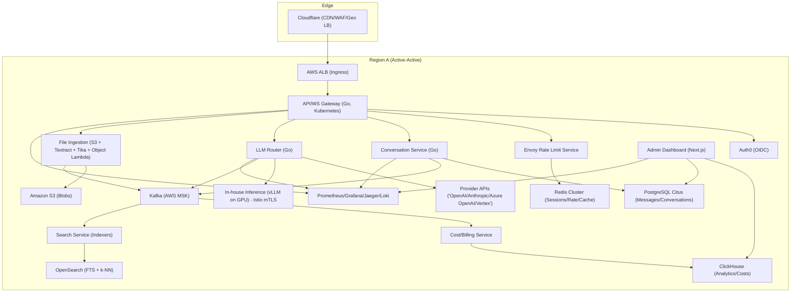
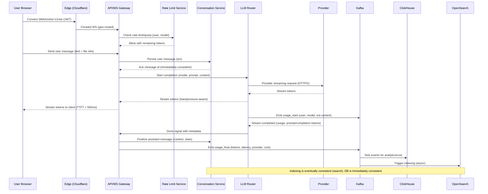

# ChatGPT-like Multimodal Conversational Platform (Global, Real-time, Multi-LLM)

> Generated by **gpt-5** (openai) on 2026-02-08T05:24:53.618Z
> Duration: 320904ms

## Overview

A globally distributed, real-time conversational AI platform supporting multi-turn chat with multiple LLM backends, multimodal inputs, and rich history management. The system is built for 20M DAUs and 500M messages/day with sub-500ms time-to-first-token via a high-performance WebSocket gateway, an LLM routing layer with fast failover, and region-affine, strongly consistent storage for conversation history. Analytics, cost tracking, and admin observability are first-class through an events pipeline into ClickHouse and Prometheus/Grafana. The core data plane is stateless, horizontally scalable on Kubernetes, and tolerant of provider or regional failures.

## Requirements

### Functional
- User authentication (OAuth/social SSO) and session management
- Create/read/update/delete multi-turn conversations and messages with context retention
- Real-time streaming of assistant responses over WebSocket (token-by-token)
- Conversation history: search, star, tag, foldering, archive, delete
- Multiple model selection across providers and in-house inference
- Rate limiting and quota enforcement by user/tier and per-model
- File upload for images/documents with virus scan, OCR/text extraction, and multimodal prompt support
- Share conversations via public links with configurable visibility
- Admin dashboard: model/provider health, usage, cost, errors, rate limits/quota states
- Cost tracking per request for accurate billing and cost attribution

### Non-Functional
- Time-to-first-token (TTFT) < 500ms p95
- Support ≥100K concurrent WebSocket connections per region
- Immediate consistency for conversation/message persistence
- Regional fault tolerance and LLM provider failover with graceful degradation
- Horizontal scalability to 500M messages/day (60k msgs/sec peak)
- Data durability (multi-AZ), point-in-time recovery, backups
- Security: WAF, DDoS protection, encryption in transit/at rest, least-privilege IAM
- Observability: distributed tracing, metrics, logs, audit trails
- Privacy and compliance readiness (GDPR/CCPA data subject controls)
- Cost efficiency: autoscaling compute/GPU, cost-aware routing, storage tiering

## Architecture Diagram

## Components

### Client Web App

- **Responsibility:** SPA for chat UI, Markdown rendering, code highlighting, WebSocket streaming, file uploads, search, and sharing
- **Technology:** Next.js + React, TypeScript, WebSocket, highlight.js, Markdown-it
- **Justification:** Mature ecosystem, SSR for SEO (shared links), excellent dev productivity and performance

### Edge CDN/WAF & Global LB

- **Responsibility:** TLS termination, caching static assets, DDoS/WAF, geo-steering to nearest healthy region
- **Technology:** Cloudflare CDN + Cloudflare Load Balancer + Bot Management
- **Justification:** Global footprint, anycast, robust WAF and health-based geo-routing to meet latency and availability targets

### API & WebSocket Gateway

- **Responsibility:** Single entry for REST and WebSocket; authZ/authN checks, rate limiting, session validation, request fan-out to internal services; streams tokens to client
- **Technology:** Go microservice on Kubernetes with NGINX Ingress (ALB) and HTTP/2; gorilla/websocket; gRPC to internal services
- **Justification:** Go delivers low-latency IO and high concurrency; stable WS handling; NGINX Ingress + ALB scale well

### Auth Service

- **Responsibility:** User identity, OAuth/social login, JWT issuance, refresh tokens, RBAC/roles (user/admin)
- **Technology:** Auth0 (OIDC) + JWT (RS256)
- **Justification:** Fast to integrate, enterprise SSO, adaptive MFA; offloads identity risk; standards-compliant OIDC

### Rate Limit & Quota Service

- **Responsibility:** Enforces per-user/tier rate limits (sliding window) and quotas; provides near-real-time counters
- **Technology:** Envoy Global Rate Limit Service + Redis Cluster; Lua in NGINX for shadow checks
- **Justification:** Envoy RLS is battle-tested; Redis offers sub-ms counters and atomicity with Lua scripts

### Session/Cache Store

- **Responsibility:** JWT blacklist, session metadata, ephemeral streaming buffers, recent context window cache
- **Technology:** Redis Cluster (6.x) with Redis Streams for ephemeral events
- **Justification:** In-memory speed, high availability via clustering and replication

### Conversation Service

- **Responsibility:** CRUD for conversations/messages, context building, sharing ACLs, foldering/tags; transactional writes
- **Technology:** PostgreSQL (Citus) multi-tenant sharded by user_id; Go service using pgx
- **Justification:** Immediate consistency and SQL semantics; Citus scales horizontally and keeps p95 low with partitioning

### Search/Indexing Service

- **Responsibility:** Full-text search over titles/messages; semantic search via embeddings; indexing pipeline
- **Technology:** OpenSearch (multi-az) + k-NN plugin; background workers (Go) for indexing
- **Justification:** Scalable search with near real-time indexing; k-NN for semantic search without extra vector DB

### LLM Router

- **Responsibility:** Model catalog, routing to providers/in-house; health checks, circuit breakers, retries, cost-aware selection; streaming token multiplexing
- **Technology:** Go service with gobreaker, HTTP/2 keep-alive pools; provider SDKs; configuration via Consul/etcd
- **Justification:** Low-latency, robust control plane with per-provider health and dynamic routing rules

### Provider Connectors

- **Responsibility:** Integrations to external LLMs and embeddings
- **Technology:** Connectors for "OpenAI/Anthropic/Azure OpenAI/Google Vertex"; retries with exponential backoff; streaming adapters
- **Justification:** Diversity reduces provider risk and enables cost/performance optimization

### In-house Inference Cluster

- **Responsibility:** Self-hosted models (vLLM) for failover and cost control; embeddings server
- **Technology:** vLLM on Kubernetes GPU nodes (NVIDIA A10/A100), Triton for embeddings; Istio for mTLS
- **Justification:** High throughput, streaming-friendly; cost-efficient for baseline models and embeddings

### File Ingestion Service

- **Responsibility:** Pre-signed uploads, virus scanning, OCR/text extraction, chunking; links assets to messages
- **Technology:** Amazon S3 + S3 Object Lambda (virus scan with ClamAV) + AWS Textract + Apache Tika; Step Functions for orchestration
- **Justification:** Serverless pipeline scales elastically; S3 durability and cost efficiency for blobs

### Cost & Billing Service

- **Responsibility:** Compute per-request cost (provider rates, tokens, GPU time), store usage, expose invoices and quotas
- **Technology:** Kafka consumers (Go) -> ClickHouse for analytics; Postgres for authoritative balances
- **Justification:** ClickHouse excels at high-ingest analytics; Postgres for transactional balances and limits

### Event Bus

- **Responsibility:** Asynchronous events: usage, costs, audit logs, indexing triggers
- **Technology:** Apache Kafka (AWS MSK)
- **Justification:** High-throughput, durable event streaming; ecosystem support

### Analytics & Monitoring

- **Responsibility:** Dashboards, alerts, traces, logs
- **Technology:** Prometheus + Grafana; OpenTelemetry + Jaeger; Loki for logs; CloudWatch for infra
- **Justification:** Proven OSS stack, vendor-neutral instrumentation

### Admin Dashboard

- **Responsibility:** Operational UI: usage, costs, errors, provider health, throttles; model catalog management
- **Technology:** Next.js + RBAC; reads from ClickHouse/Prometheus/Postgres
- **Justification:** Unified operational control plane with low-latency analytics queries

### CDN Assets & Static Hosting

- **Responsibility:** Serve static JS/CSS/images
- **Technology:** Cloudflare + S3 static site hosting
- **Justification:** Global low-latency delivery for assets

## Data Flow

## Data Storage

| Store | Type | Justification |
|-------|------|---------------|
| PostgreSQL (Citus) | sql | Strong consistency and transactions for conversations/messages; Citus provides horizontal sharding by user_id with high write throughput and low-latency queries |
| Redis Cluster | cache | Sub-millisecond counters for rate limits, sessions, ephemeral streaming buffers, and hot context windows |
| Amazon S3 | blob | Durable, cost-effective storage for file uploads, images, and large attachments; lifecycle policies for tiering |
| OpenSearch | search | Full-text and semantic search with k-NN; scalable indexing and near real-time search for conversation history |
| Kafka (AWS MSK) | queue | Durable, scalable event streaming for usage, billing, indexing, and audit logs decoupling producers/consumers |
| ClickHouse | sql | High-ingest, columnar analytics for usage and cost reporting; sub-second aggregations at scale |

## API Design

| Method | Endpoint | Description |
|--------|----------|-------------|
| WS | `/v1/ws` | Bidirectional WebSocket for sending user messages and receiving token-streaming responses and events |
| POST | `/v1/conversations` | Create a new conversation (title, tags, model selection, visibility) |
| GET | `/v1/conversations` | List conversations with filters (folder, tag, starred) and pagination |
| GET | `/v1/conversations/{id}` | Get a conversation with messages (server-side pagination) |
| POST | `/v1/conversations/{id}/messages` | Add a user message to a conversation (text, file refs, tool calls) |
| GET | `/v1/messages/{id}` | Get message detail and streaming status |
| GET | `/v1/search` | Search conversations/messages (full-text + semantic options) |
| GET | `/v1/models` | List available models and tiers, pricing metadata |
| POST | `/v1/files` | Initiate file upload and get pre-signed URL; returns file_id |
| POST | `/v1/share/{conversation_id}` | Create/update share link (public/unlisted/expire) |
| GET | `/v1/usage` | Per-user usage and remaining quota by period |
| GET | `/v1/admin/metrics` | Admin: provider health, error rates, throughput, cost summaries |
| PUT | `/v1/admin/models` | Admin: manage model catalog, routing weights, and availability |

## Scalability Strategy

- Traffic and sessions: Anycast via Cloudflare to nearest region. Sticky session not required; WebSocket connections are long-lived and evenly distributed via ALB. Gateway pods autoscale on CPU and open FDs; each Go pod targets ~4–5K concurrent WS; 30 pods suffice for 150K WS with headroom per region.
- Storage: Citus shards by user_id across nodes; co-locate primary and replicas in same AZ to minimize latency. Connection pooling with PgBouncer. Hot partitions handled by rebalancing shards. PITR and logical replication to DR region.
- Search: OpenSearch domain scales horizontally across data nodes. Index with 1–3 primary shards per index and ILM for rollover. Async indexers consume from Kafka for sustained throughput.
- LLM routing: Health probes and circuit breakers per provider/region; latency-aware load balancing and hedged requests before first token. In-house vLLM autoscaling on GPU metrics (queue depth, tokens/sec). Keep-alive HTTP/2 pools to reduce TTFB.
- Rate limiting: Redis Cluster with hash tags for per-user keys ensures single-shard updates. Use sliding window with Lua for atomicity. Quotas aggregated periodically from ClickHouse and persisted to Postgres for authority.
- WebSockets: Separate HPA based on concurrent connections and network IO. Use SO_REUSEPORT and pod anti-affinity. Idle pings to detect dead peers. Backpressure controls to avoid OOM.
- Multi-region: Active-active per region; users are region-affined based on home region stored in profile. Cross-region failover via Cloudflare LB health checks; if home region is down, read last durable snapshot from DR and write to degraded mode (queue for backfill) with user-notice.
- Observability: OpenTelemetry traces propagate across gateway, LLM router, connectors. SLO-based autoscaling and alerting for TTFT and error budgets.

## Trade-offs

### Use PostgreSQL (Citus) for conversations instead of a globally-distributed DB (e.g., Spanner/CockroachDB)

**Pros:**
- Immediate consistency and strong SQL semantics
- Operational familiarity and cost-effective scaling
- Shard-by-user keeps latency low

**Cons:**
- Cross-region strong consistency not automatic
- Requires shard management and regional affinity policies

### WebSockets for streaming vs Server-Sent Events

**Pros:**
- Bidirectional control channel (cancel, tool calls)
- Better concurrency characteristics and fewer HTTP headers
- Widely supported by CDNs/LBs

**Cons:**
- More complex connection lifecycle management
- Stateful long-lived connections impact autoscaling

### OpenSearch for full-text + k-NN vs separate vector DB

**Pros:**
- Single search stack reduces ops overhead
- Near real-time indexing with scalable ingestion

**Cons:**
- k-NN recall/latency may trail specialized vector DBs
- Index tuning and memory footprint can be heavy

### Auth0 for identity instead of building in-house

**Pros:**
- Faster time-to-market, robust SSO/MFA
- Security updates and compliance handled by vendor

**Cons:**
- Vendor cost and dependency
- Rate limits and token introspection latency considerations

### Kafka + ClickHouse for analytics and cost tracking

**Pros:**
- High-ingest, low-cost analytics at scale
- Flexible schema evolution for events

**Cons:**
- Operational complexity (clusters to manage)
- Eventual consistency for analytics views

### In-house vLLM cluster as secondary routing target

**Pros:**
- Cost control for common models
- Resilience to third-party outages

**Cons:**
- Requires GPU capacity management and model maintenance
- May lag on latest proprietary model capabilities

### Async indexing to OpenSearch (eventual) while DB is immediate

**Pros:**
- Protects write path latency and TTFT
- Scales independently

**Cons:**
- Search results may lag by seconds
- Requires reconciliation jobs for rare failures
